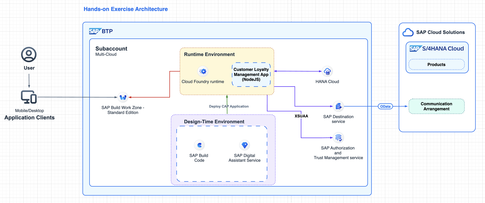

# SAP Build Code – Generative AI-powered development with Joule Copilot

## Highlights

You will work through a set of exercises that highlight the capabilities of **SAP Build Code** with **Joule AI copilot**. Also showcased are the integration capabilities between **SAP Build Code, SAP S/4HANA Cloud**.

The business scenario for this exercise is focused on a points-based customer loyalty programme with data related to Customers, Purchases and Redemptions. Within the Purchases area we will integrate our product data from **SAP S/4HANA Cloud**. Using **SAP Build Code** and the **Joule AI copilot** you will create data entities and backend logic. 

## Hands-on Architecture

