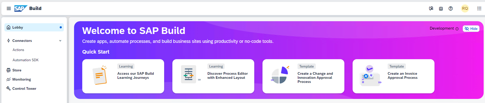
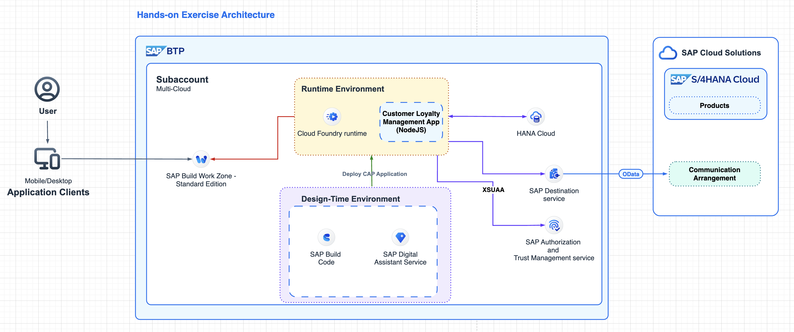
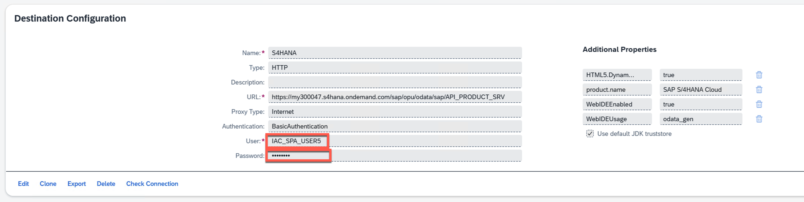
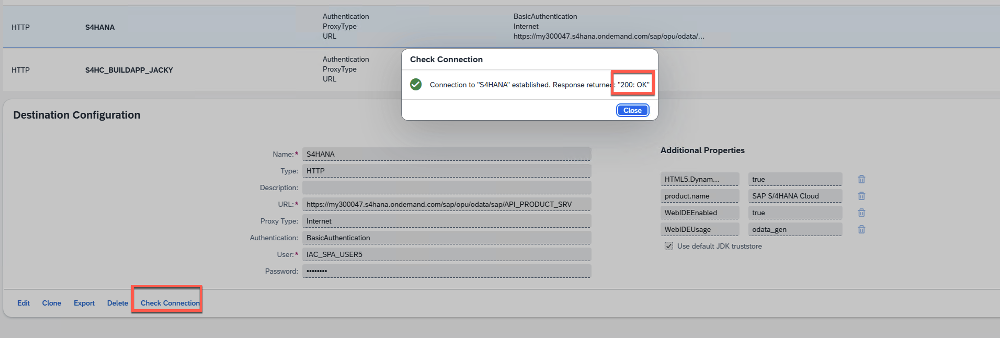

# Getting Started - Preparation
---
Let's start the exercise and check if everything is ready to go.
Please make sure you have completed all the necessary prerequisites listed below. If not, please raise your voice so that we can assist you early in the session.

## Prerequisites
Please keep the following links and resources available:

1. Make sure you have access to a browser, preferably Google Chrome.
2. Log on to the Development Lobby  

## Hands-on Architecture

## Import the S/4HANA Cloud integration destination

> Download a sample destination for S/4HANA Cloud [S4HANA](https://robin-qiu.github.io/gen-ai-sap-build-code/blob/main/docs/01-build-code-getting-started/vx_attachments/149113364469114/S4HANA ':include')  :truck::truck::truck:.

2. Import the destination into your BTP subaccount.

3. The credential will be supplied during the adoption lab hands-on session.

4. If you try to "**Check Connection"**, then you will get **"200: OK"** message and this is a normal feedback.

