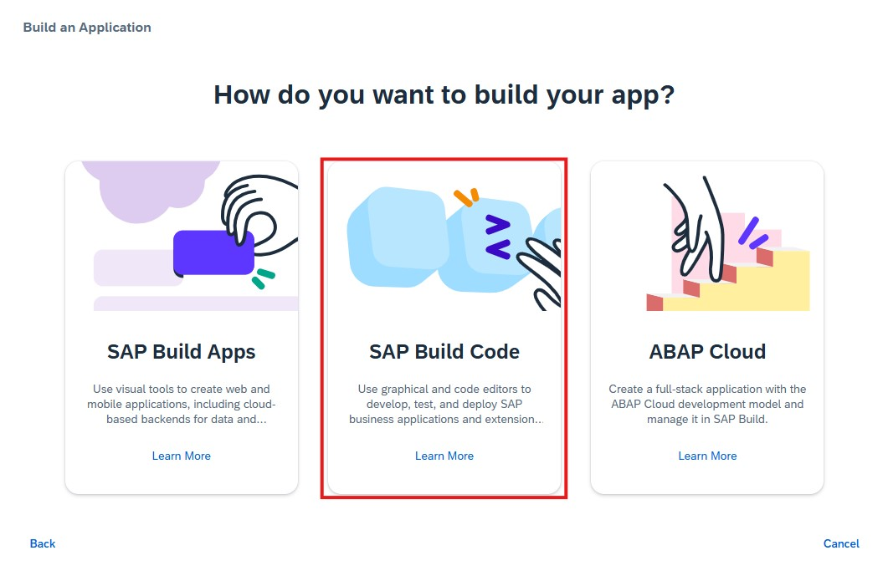
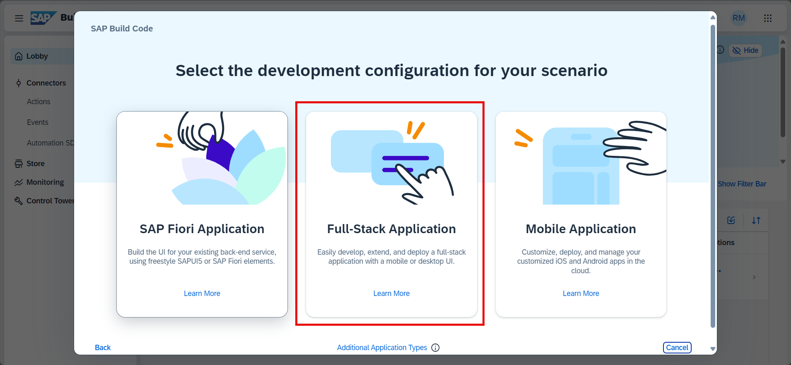
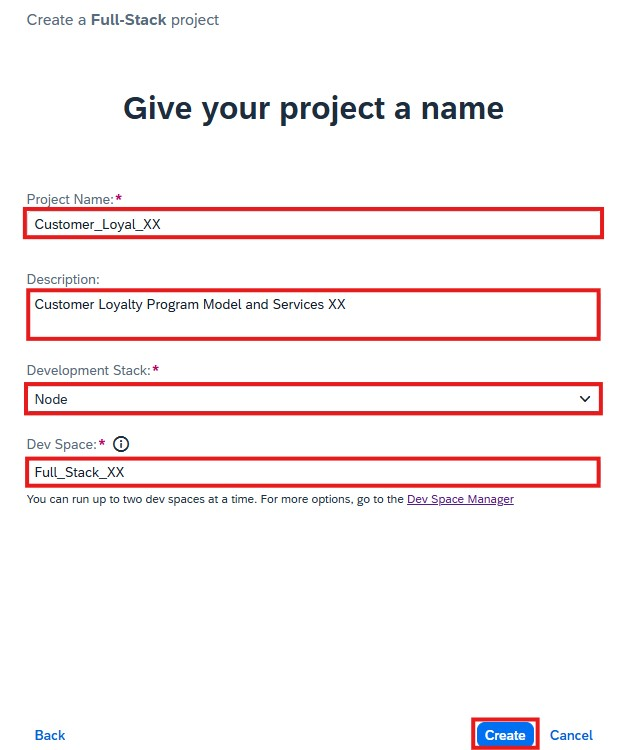

# Create SAP Build Code Project 

## Access Lobby

The starting point for this tutorial is the Lobby of SAP Build, the central entry point for all SAP Build products.

Open the lobby: <a href="https://iac-sap-build-code.eu10.build.cloud.sap/lobby" target="_blank">SAP Build Code Lobby</a>

<!-- Use the provided user credentials to log on using **https://iac.accounts.ondemand.com/** as Identity Provider

- User Name: **rmiller${number}**
- Password: **Welcome1!**

 -->

## Create a new project

1. Click on **Create** button. Then click **Create** once again.

    

2. Select **Build an Application**

    

3. Select **SAP Build Code**

    

4. Select **Full-Stack Application**

      

5. On the next screen, enter the following:
    
   - Project Name: `customer_loyal_${number}`
   - Description: `Customer Loyalty Program Model and Services ${number}`
   - Development Stack: `Node.js`
   - Dev Space: `Full_Stack_${number}`

   > [!WARNING]
   > Use the provided name to easily identify your work.

   Click the **Create** button.
   
   

6. Notice that the Project is in status **Pending Creation**.

    

    > [!NOTE]
    > The creation of the project can take up to 1 minute.

7. After the project is created click on the project name to open the development environment. 

    

8. You might be asked to confirm the cookies settings by clicking OK (or Open Settings to update the settings)

    

9. SAP Build Code will be opened, based on SAP Business Application Studio - in the background.
    
    > [!NOTE]
    > Please allow some time for SAP Build Code to open!

    
    
