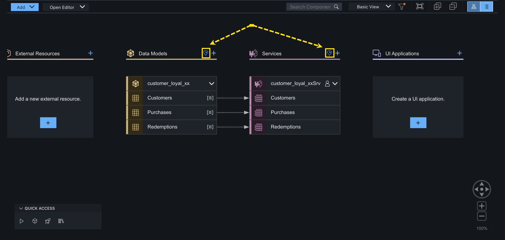

# Module 1 - Unit 2: Create Data Entities with Joule  

In this lesson, we will create the **data model** and the services for the customer loyalty program application.

We could create the data model visually from the Storyboard or by writing the code manually. However, we are going to use the **generative AI** capabilities of **Joule and SAP Build Code** to generate the code. Thus, significantly **reducing the time and effort** required to develop the customer loyalty program application.

1. Launch the Joule digital assistant by navigating to **Joule** tab via the sidebar menu on the left. 

   > [!TIP]
   Please wait for the digital assistant to open. If it fails to open then please refresh your browser.

    

2. Select (or type in) **`/cap-gen-model`** command for generating a CAP application.

    

3. Generate the data model and services by copying and pasting the prompt into the box where it says ‘Describe what you need to do’.

    ```code
    Design a customer loyalty program application. Define 3 data entities: Customers, Purchases and Redemptions. 
    Each customer must have the following fields: name, email, 7-digit customer number, total purchase value, total reward points, ‘total redeemed reward points’. 
    All fields for each customer should be integer except name and email that will be stored as string. 
    Purchases should include the following fields: purchase value, reward points and selected product. 
    All fields in Purchases must be integer except selected product. 
    Redemptions must have 1 field in integer: redeemed amount. 
    Each purchase and redemption will be associated to a customer. Use associations instead of compositions.
    ```

    > [!NOTE]
    We want to create a Customer Loyalty Program application where customer can get bonus points for there purchases of products and can redeem these points.

    Select **Generate**.

    

    The code should be generated now below your prompt.

    

4. Review the generated data model and accept it by clicking the **Accept** button.

    <!-- Depending on the server, it can take up to 2 minutes for Joule to create the data models and services for you.<br>
    Once you accept the code, you will see the update on the right side under Storyboard tab<br> -->

    

5. Once the code is accepted, the update will be reflected on the Storyboard. 

    > [!TIP]
    Please allow some time for Joule to generate the data models and services.
    
    

6. Now, let's try editing our existing data model with the help of Joule by adding a property named `phoneNo` to our Customers enity.

    Select (or type in) **`/cap-edit-model`** command in Joule window.
    
    

7. Select **#db/schema.cds** as data schema file.

    

8. Copy and paste the prompt from below.

    ```code
    Add a property named 'phoneNo' to 'Customers' entity
    ```
    
    Click on **Generate**.

    

9.  Make sure that the **'phoneNo'** property is added to the data model in a suggested Joule output.

    Accept the changes to the data model by clicking the **Accept** button.

    

10. Refresh your browser.

    

10. Notice that you can also engage with Joule directly from your **Storyboard** by clicking on the Joule icon beside **Data Models** and **Services**.

    

11. Click on Joule icon beside **Data Models**.

    Click on **Sample prompts** to understand what type of prompts can be specified.

    

12. For example, let's use Joule to explain to us once again the data model in our project.

    Copy and paste the prompt from below to the input box.
    
    > [!Note]
    >Joule's response may vary each time. This is just an example. 

    ```code
    Explain me the data model
    ```

    Click on **Generate**.

    

13. Review the output of the Joule with an explanation of the data model.

    

    > [!TIP]
    >Joule helps with understanding the existing CAP project (maybe the one that was created by someone else). 
    >Moreover, the output can also be used as design documentation of data model for future reference.
    >
    >Refer to the blog post <a href="https://community.sap.com/t5/technology-blogs-by-sap/enhance-your-existing-cap-projects-with-joule-in-sap-build-code/ba-p/13777244" target="_blank">Enhance your existing CAP projects with Joule in SAP Build Code</a> to understand more on how you can enhance your existing CAP projects with Joule in SAP Build Code and see the examples of the other prompts you could write to Joule.

*Optionally* you might play around with some further prompts, like 

<!-- - **`Explain me the data model`** - 
    Joule helps with understanding the solution, moreover, the output can also be used as design documentation of data model for future reference. -->
- **`Add comments to the data model`** - Joule helps to improve the interpret-ability and maintenance. This is a bit tricky as Joule may refuse it, but try to convince it with "yes, you are allowed to do it"
- **`Review and criticize the code`** - Joule acts as a peer developer for code review
- **`Implement the suggestions`** - Joule help to implement the suggestions from last code review
- **`Apply best practices of CDS data modeling`** - Or simply ask Joule to apply the general best practices of CDS data modeling without explicit code review
- **`Make it production ready`** - Joule help with final check on the data model before production.
