# Module 1 - Unit 3: Enhance Initial Data with Joule  

In this lesson, we will utilise the generative AI capabilities of Joule and SAP Build Code to generate initial data. This initial data will be deployed with your application.

## Enhance Customers Initial Data

1. Open the the **Data Editor**. Navigate to **Open Editor**, then select **Sample Data**.

    


2. Select the **Customers** data entity, then select the **INITIAL DATA** tab.

    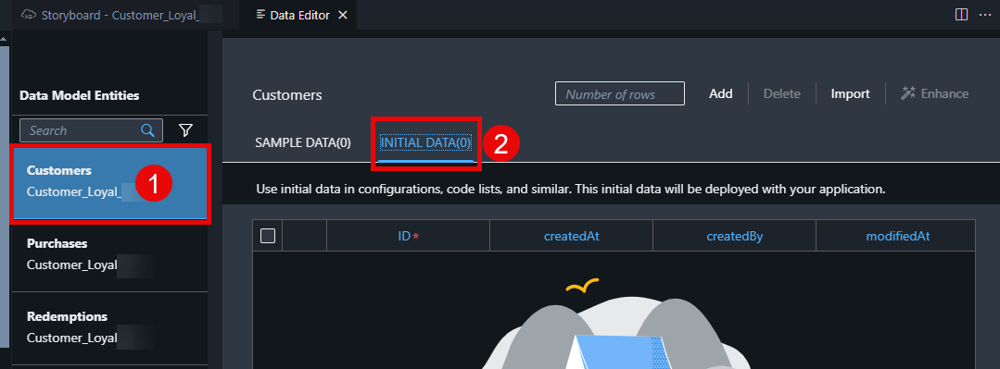

3. Enter **5** into the **Number of rows** field. Select the **Add** button to add 5 more rows to the entity.

     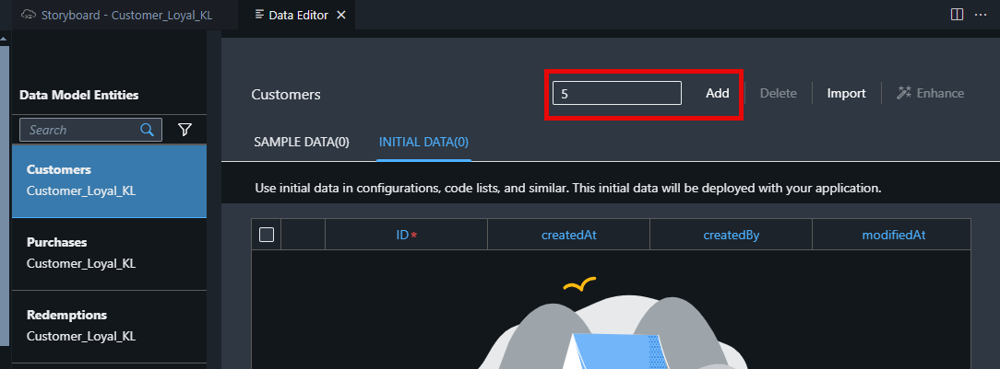

4. Select **Enhance**. This will open again Joule to modify the sample data. 

     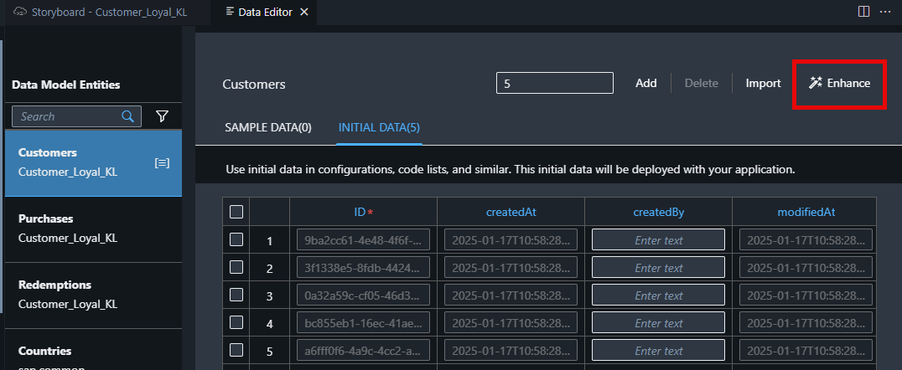

5. **Copy and paste** the following Prompt into Joule and select Generate:

    ```code
    Enhance my sample data with meaningful data. Any phone numbers must be 10 digits. All customer numbers must be 7 digits and one customer must use the customer number 1200547. No fields may be empty. Total purchase value must be smaller than 10000 und unround. Total reward points and total redeemed reward points both must be unround and different and always sum to one-tenth of the total purchase value for each customer. Be also assure that no fields are empty. Especially check that CreatedBy fields are enhanced with respective data
    ```

    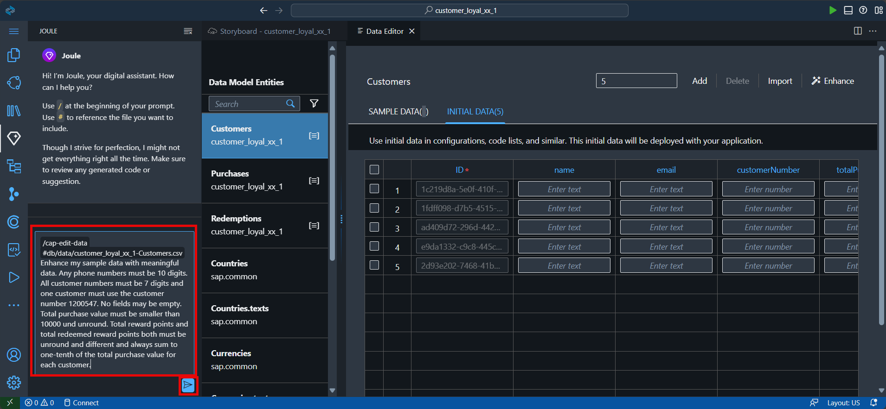
 
6. Select **Accept** to approve the sample customer data generated by Joule.
. You can see the customer names, email adresses, createdBy and purchases are created. Accept the new Sample Data created by Joule. 

    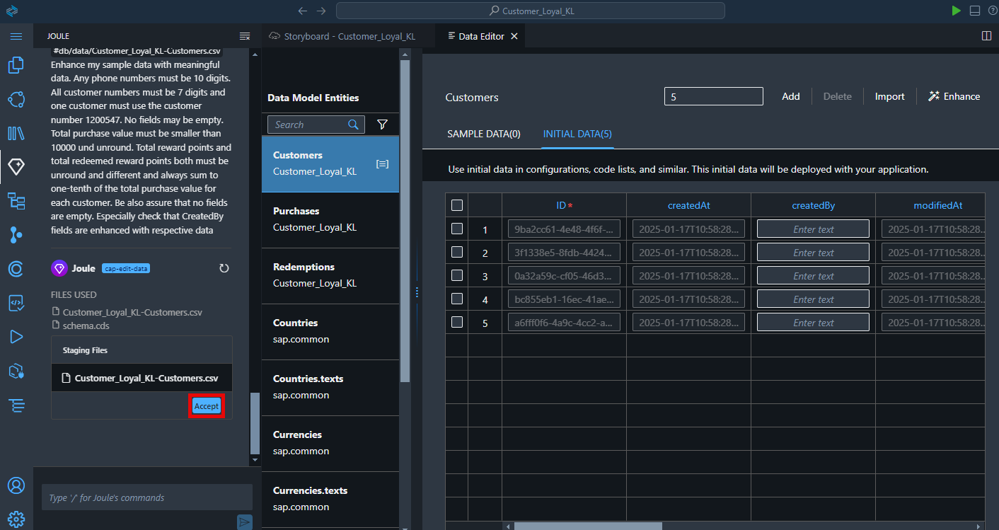

7. Verify in the customer list that one customerNumber was changed to **1200547**, if not change one customer number manually to **1200547**. 

    **This step is needed for the demo purpose. Later in the exercise, we will be scanning a Customer Loyalty Card that will have a barcode with this number.**

    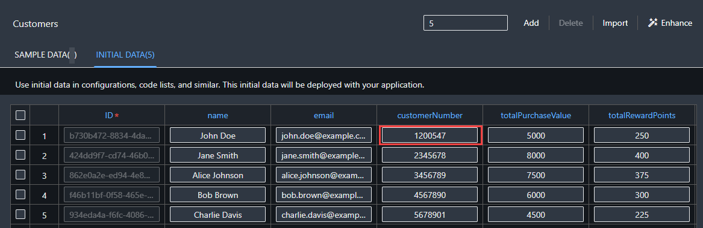

## Enhance Purchases Initial Data

1. Select the **Purchases** data entity.

2. Select the **INITIAL DATA** tab.

3. Enter **5** into the Number of rows field.

4. Select the **Add** button to add 5 more rows to the entity.

    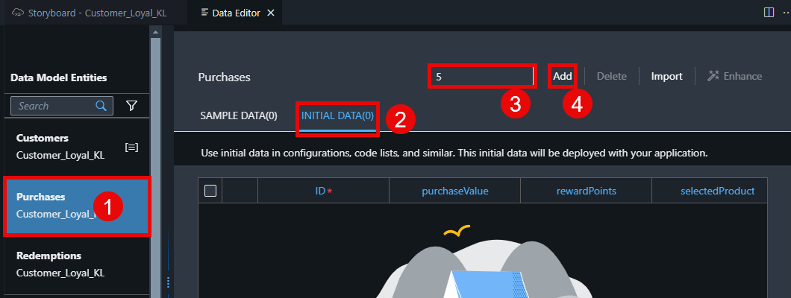

5. Assign a unique customer ID to each purchase entry.

    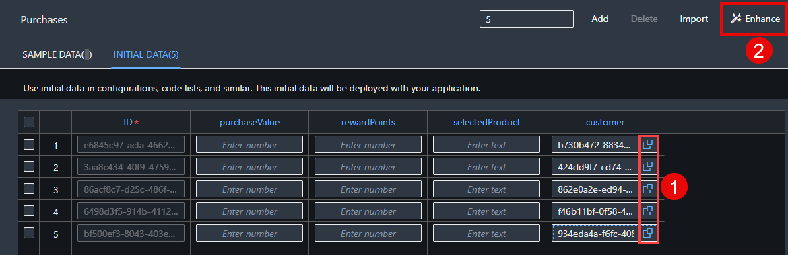

6. Select **Enhance**.

7. Copy the following text.

    ```code
    Enhance my sample data with meaningful data using electronic office products. Each ‘purchaseValue’ will be between 50 and 1000. Ensure that each ‘rewardPoints’ is always one-tenth of the ‘purchaseValue’. Ensure that the ‘customer’ field is populated. Leave no field empty. Check that all fields are populated with data.
    ```
8. Paste the copied text into the Joule prompt, select **Generate**.

    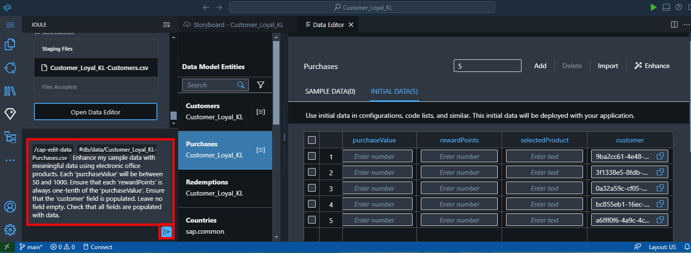

    Wait for Joule *… Thinking …* and the data to be generated. The AI generation may take a little while.

9. Select **Accept**.

    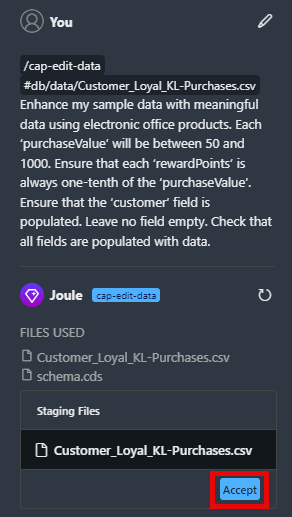

10. The initial data for the **Purchases** entity has been updated.

    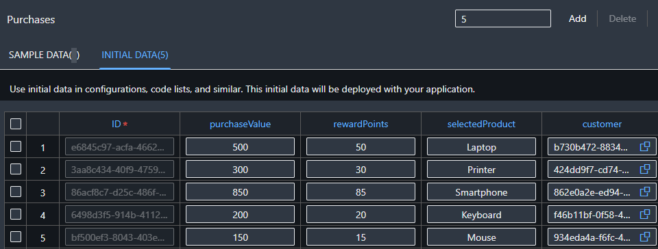

## Enhance Redemptions Initial Data

1. Select the **Redemptions** data entity.

2. Select the **INITIAL DATA** tab.

3. Enter **5** into the **Number of rows** field.

4. Select the **Add** button to add 5 more rows to the entity.

    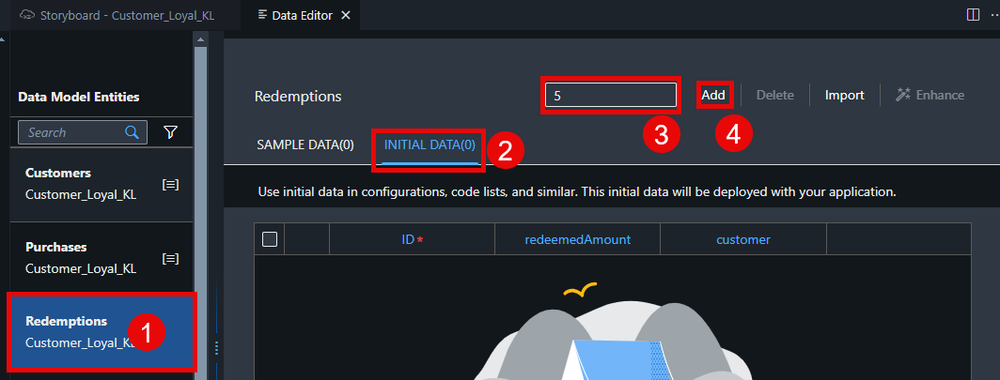

5. Assign a unique customer ID to each record.

    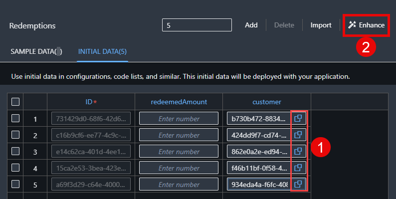

6. Select **Enhance**.

7. Copy the following prompt in Joule.

    ```code
   Ensure that each redeemed amount is different and between 10 and 100.
    ```

8. Select **Generate**. This may take a little time.

    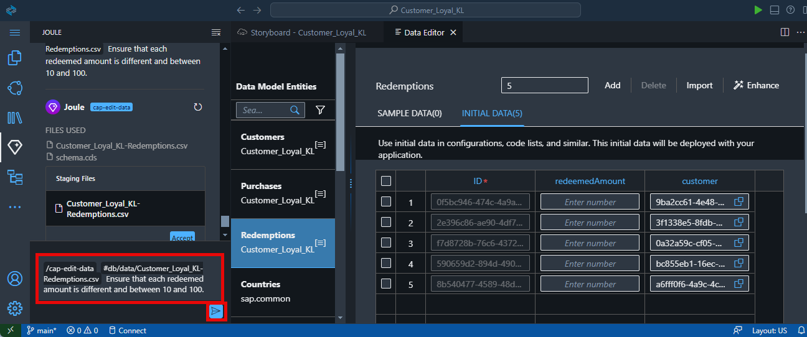

9. Select **Accept**.

    

10. The initial data for the **Redemptions** entity has been updated.

    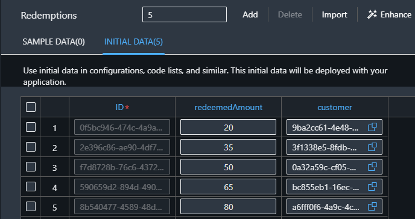
