# SAP Build Code and Joule Copilot

## Create Sample Data with SAP Joule

In this lesson, we will utilise the generative AI capabilities of Joule
and SAP Build Code to generate sample data. This data will be used to
test and preview the backend service of our customer loyalty program
application.

1. In the Joule panel, select the command **/cap-gen-data**

    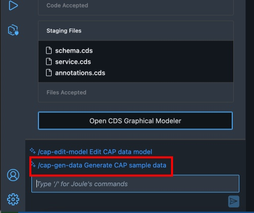

2. Copy and paste the following Prompt into Joule and select Generate:

    ```
    Generate realistic sample data for the entities as follows:

    Customers: Create 5 customers. All customer numbers will
    be 7 digits and one customer must use the customer number 1200547. No
    field may be empty. Total purchase value must be smaller than 10000.
    Total reward points and total redeemed reward points both must be
    unround and different and always sum to one-tenth of total purchase
    value for each customer.

    Purchases: Generate 5 purchases of electronic office products. Each 
    ‘purchaseValue’ will be between 50 and 1000. Ensure that each 
    ‘rewardPoints’ is always one-tenth of the ‘purchaseValue’. Ensure 
    that the ‘customer’ field is populated with a key from the Customers table.

    Redemptions: Generate 5 redemption records. Ensure that each redeemed 
    amount is different and between 10 and 100. Ensure that the ‘customer’ 
    field is populated with a key from the Customers table.
    ```
    

3. Joule will take a moment and will generate CSV files containing the generated Customers, Purchases and Redemptions. Select **Accept** to add the data to your project.

    

4. To view the data that was added to your project, click on the data icon on one of your entities:

    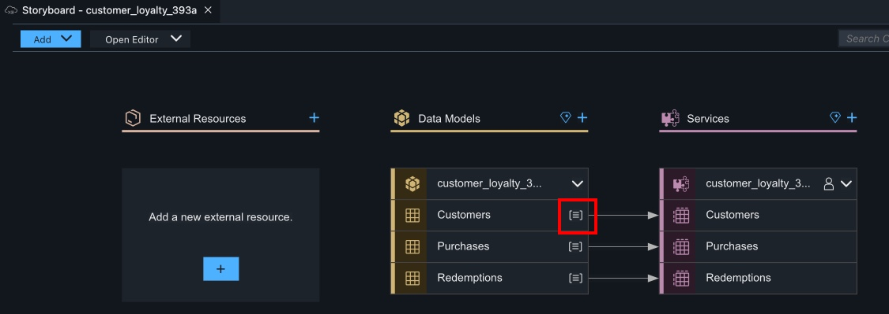

5. Use the Data Editor to browse the generated Customers, Purchases, and Redemptions.

    

## Enhance Customers Initial Data
This initial data will be deployed with your application.

1. Select the **Customers** data entity, then select the **INITIAL DATA** tab.

    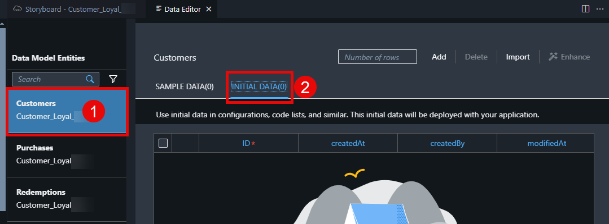

2. Enter **5** into the **Number of rows** field. Select the **Add** button to add 5 more rows to the entity.

    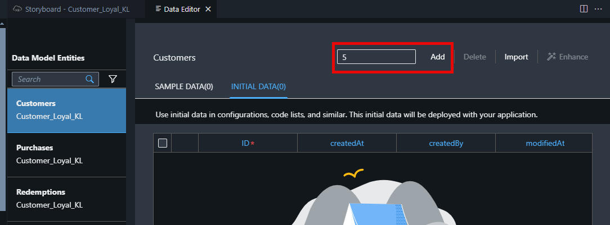

3. Select **Enhance**. This will open again Joule to modify the sample data. 

    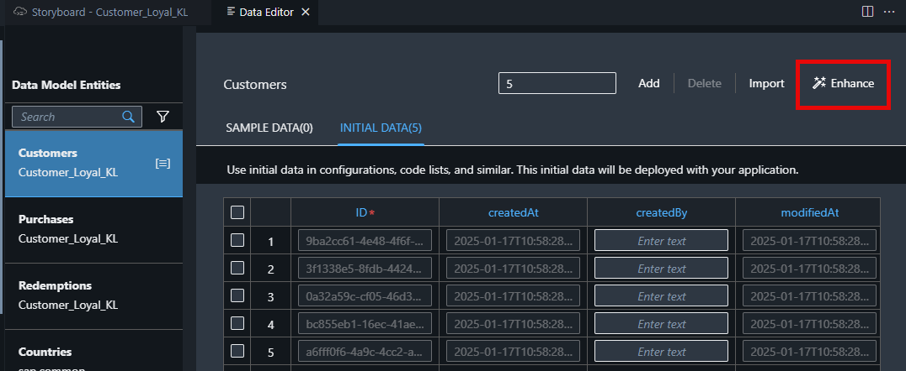

4. **Copy and paste** the following Prompt into Joule and select Generate:

    ```code
    Enhance my sample data with meaningful data. Any phone numbers must be 10 digits. All customer numbers must be 7 digits and one customer must use the customer number 1200547. No fields may be empty. Total purchase value must be smaller than 10000 und unround. Total reward points and total redeemed reward points both must be unround and different and always sum to one-tenth of the total purchase value for each customer. Be also assure that no fields are empty. Especially check that CreatedBy fields are enhanced with respective data
    ```

    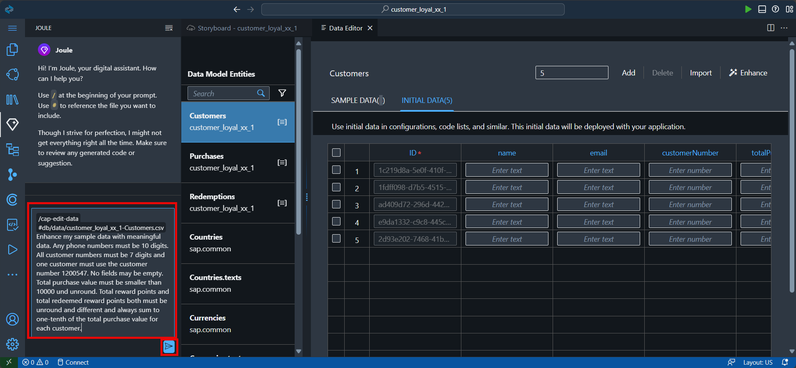
 
5. Select **Accept** to approve the sample customer data generated by Joule.
. You can see the customer names, email adresses, createdBy and purchases are created. Accept the new Sample Data created by Joule. 

    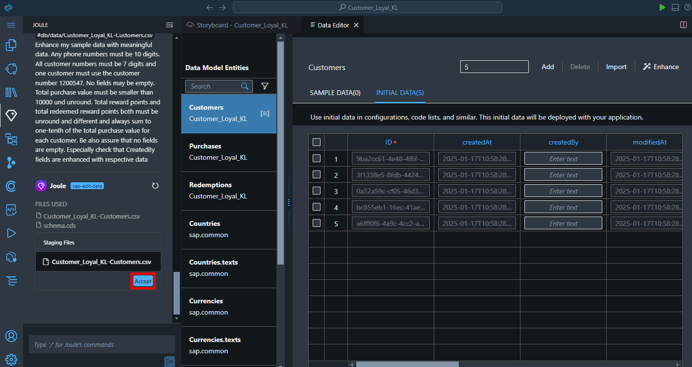

6. Verify in the customer list that one customerNumber was changed to **1200547**, if not change one customer number manually to **1200547**. 

    **This step is needed for the demo purpose. Later in the exercise, we will be scanning a Customer Loyalty Card that will have a barcode with this number.**

    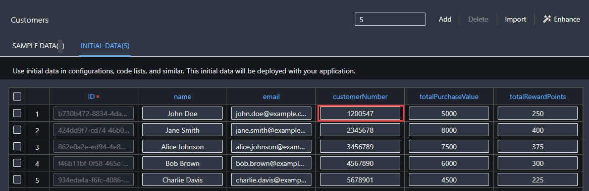

## Enhance Purchases Initial Data

1. Select the **Purchases** data entity.

2. Select the **INITIAL DATA** tab.

3. Enter **5** into the Number of rows field.

4. Select the **Add** button to add 5 more rows to the entity.

    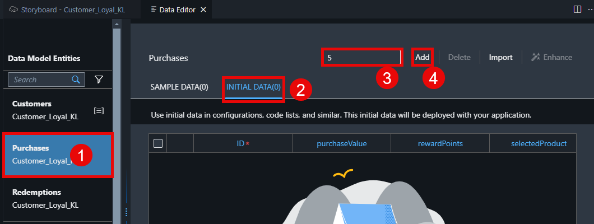

5. Assign a unique customer ID to each purchase entry.

    

6. Select **Enhance**.

7. Copy the following text.

    ```code
    Enhance my sample data with meaningful data using electronic office products. Each ‘purchaseValue’ will be between 50 and 1000. Ensure that each ‘rewardPoints’ is always one-tenth of the ‘purchaseValue’. Ensure that the ‘customer’ field is populated. Leave no field empty. Check that all fields are populated with data.
    ```
8. Paste the copied text into the Joule prompt, select **Generate**.

    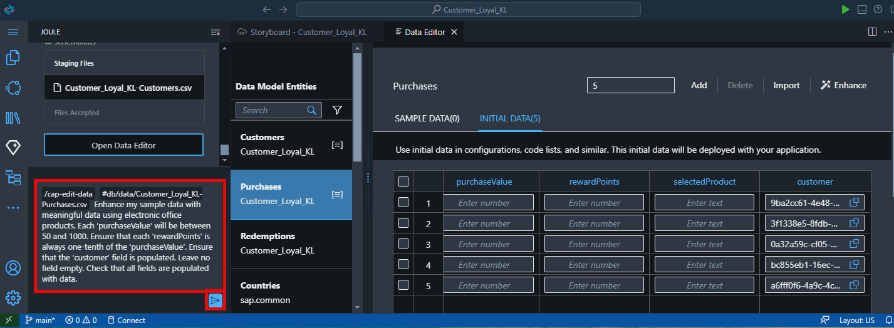

    Wait for Joule *… Thinking …* and the data to be generated. The AI generation may take a little while.

9. Select **Accept**.

    

10. The initial data for the **Purchases** entity has been updated.

    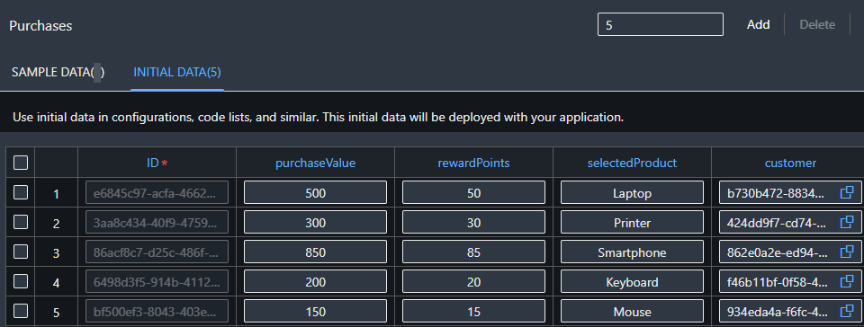

## Enhance Redemptions Initial Data

1. Select the **Redemptions** data entity.

2. Select the **INITIAL DATA** tab.

3. Enter **5** into the **Number of rows** field.

4. Select the **Add** button to add 5 more rows to the entity.

    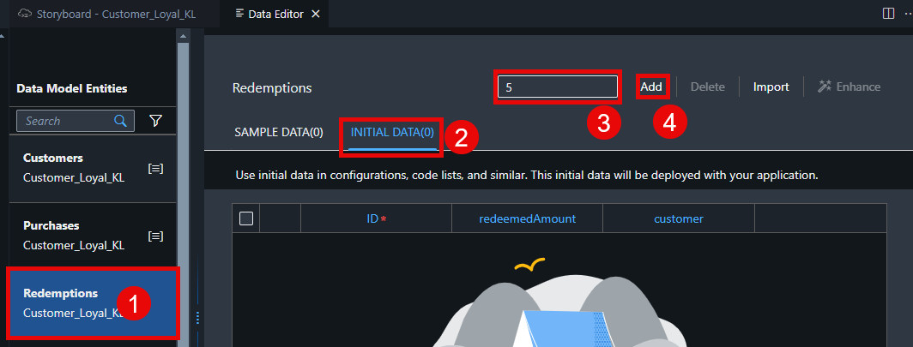

5. Assign a unique customer ID to each record.

    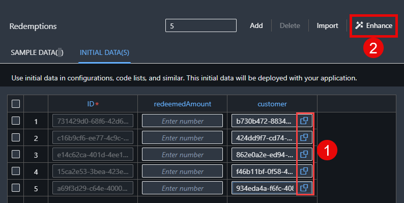

6. Select **Enhance**.

7. Copy the following prompt in Joule.

    ```code
    Ensure that each redeemed amount is different and between 10 and 100.
    ```

8. Select **Generate**. This may take a little time.

    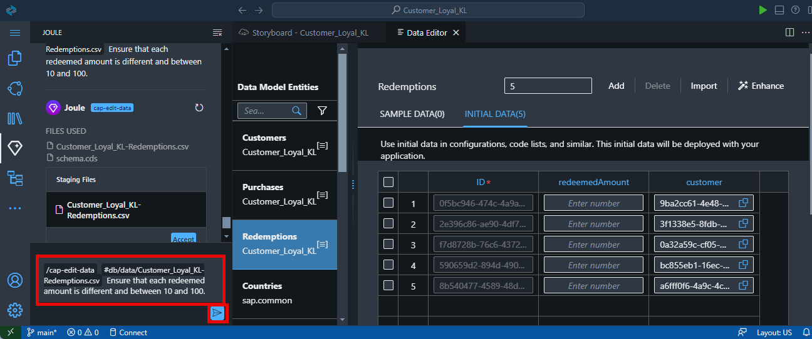

9. Select **Accept**.

    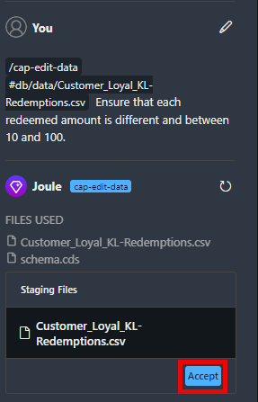