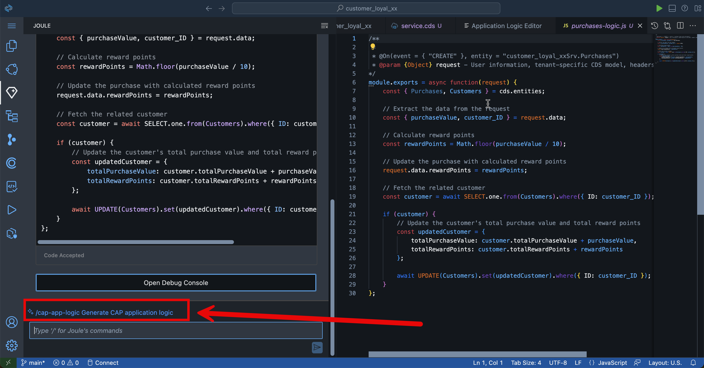

# Create Backend Logic with Joule  

We already have created the entities, services, and sample data with Joule. Now we want to create some logic for our app. We would like to calculate the bonus points automatically when a customer makes a purchase. Additionally, we want to provide logic for customers to redeem these bonus points.


## Purchases Backend Logic

1. Go to **Storyboard**. Click on one of the entities under **Services** and **Open in Graphical Modeler**

    


2. Select **Purchases** entity by clicking on the title. 
    
    > [!NOTE]
    If you can not see the Purchases entity you may have to zoom out the view.

3. Select on **Add Logic**

    

4. Leave everything by the default value and select **Add**

    
 
5. Select the Phase **Before** and the Standard Event **Create**.

    > [!NOTE] That means this logic will be automatically executed if a new purchase is done.

6. Go to **Open Code Editor** > **Application Logic**.
 
    > [!NOTE] This will open Joule again to create the logic for us.

    

7. Use the following prompt in Joule to create a backend logic:

```code
Reward points of each purchase will be the one-tenth of the purchase value. Each purchase value will be added to the total purchase value of the related customer. Each reward points will be added to the total reward points of the related customer.
```

8. Select **Generate**.

    

9. So Joule created now following logic:
 - Check if the customer exists
 - Calculates the rewardPoints from the purchase value
 - Updates the total purchase value and the total reward points in the customers entity

10. **Accept** the code created by Joule. 

    


   > [!NOTE]
   Joule may generate different codes for the same prompt. If the code for the backend logic differs but achieves the same result, you can ignore the variation and continue working on the exercise.

11. Note that you can also adjust already existing logic.

    Select (or type in) **`/cap-app-logic`** command in Joule window.
        
    

12. Let's ask Joule to include additional error handling. Copy and paste the prompt from below.

    ```code
    Add error handling
    ```
    
    Click on **Generate**.

    

13. Make sure that the error handling logic is added in a suggested Joule output.

    Accept the changes by clicking the **Accept** button.

    


## Redemptions Backend Logic

Now we continue with the Redemptions.

1. Go to back **service.cds** tab. 

2. Select **Redemptions** entity by clicking on the title. 

3. Select **Add Logic**

    

4. Select **Add**

    

5. Select **Before** and **Create**. 

6. Go to **Application Logic** under **Open Code Editor**.

    

7. Use the following Prompt in Joule to create a backend logic:

    ```code
    Deduct the redemption amount from ‘totalRewardPoints’ of the related customer. Add the same redemption amount to the ‘totalRedeemedPoints’ of the related customer.
    ```

    

8. **Accept** the code created by Joule. 

    

9.  Have a closer look at the generated code. It includes some logic to check if a customer has enough points for the redemption.

    > [!NOTE]
    Joule might generate different codes for the same prompt. So, you might have a different code for the backend logic which is completely fine if it does the same job. You can ignore this and keep working on the exercise.