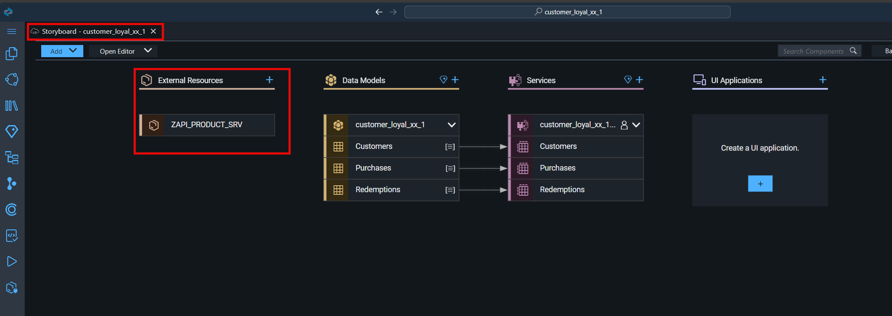
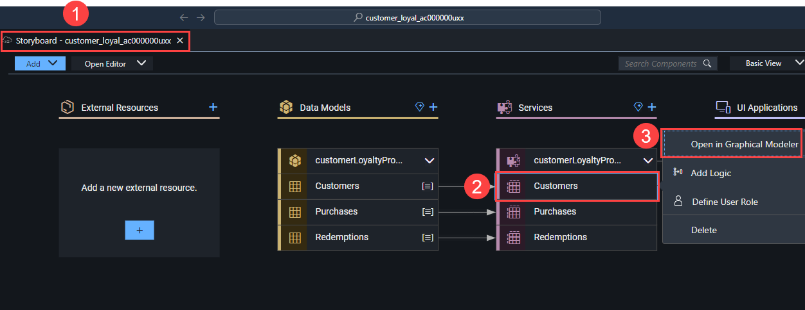
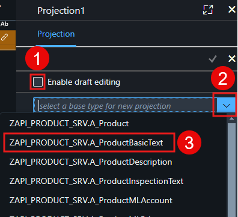

# Add External Data Resource  

In this part of the tutorial we will connect to an SAP S4/HANA to get all the related product data.

1. Use menu on the left to open **Service Center**.

    

2. Under  **Systems** -> **Catalogue of Services** you will find the BTP destination **s4hana**. Click on it.

    

3. Search for `product` in the filter bar for Services and select service **ZAPI_PRODUCT_SRV**

    

4. Select **Add to CAP Project**

    

    

    > [!NOTE]
    This destination is already configured by your subaccount admin. The destination is connected to a SAP S/4HANA on-premise system. For more information about the API go to the SAP Business Accelerator Hub: https://api.sap.com/api/API_PRODUCT_SRV/overview

5. Check if the **External Resources** got updated on the **Storyboard**.

    

    > [!NOTE]
    It may take a short time to update!

6.  Use **Storyboard** and click on one of the entities under **Services** -> **Open in Graphical Modeler**

    

7. Press **Add Projection**.

    >[!NOTE]
    You can drop the new entity anywhere in the editor.

    

8. Disable the **Enable draft editing** option and select the data entity: **`ZAPI_PRODUCT_SRV.A_ProductBasicText`** from the dropdown list.

    

9.  Select **Save**.

    

10. Note that folder *external* has been automatically added to *srv* folder and contains *ZAPI_PRODUCT_SRV.cds* and *ZAPI_PRODUCT_SRV.xml* files - these are the definitions of the external S/4HANA service that you've added to CAP Project.

    Also note that a new entity *A_ProductBasicText* has been added to *service.cds*.

    
