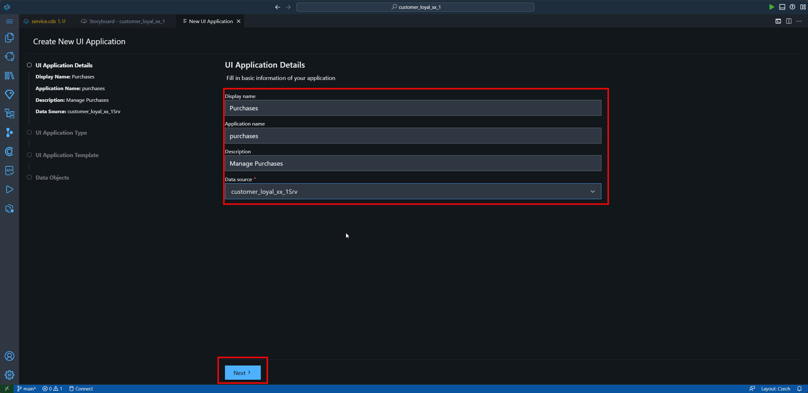
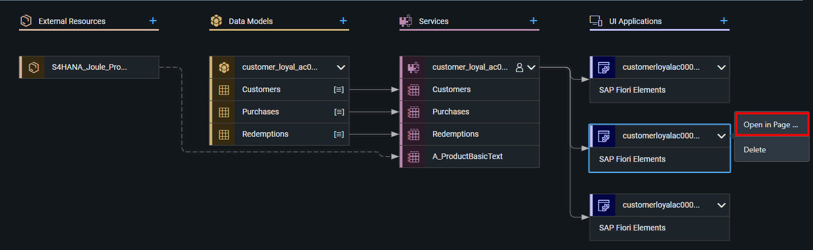
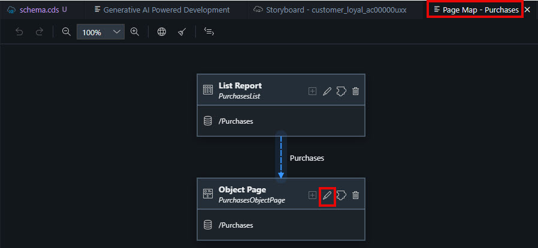
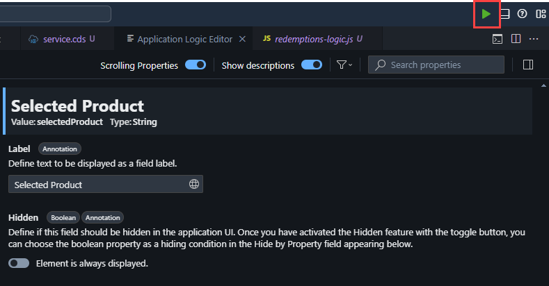
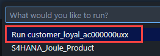
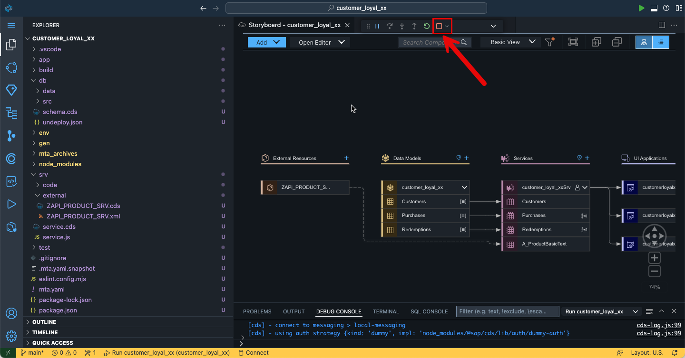

# Add Admin UI Applications

You’ll design a user interface to showcase and test the content we’ve developed for the customer loyalty program application.

1. Go back to the **Storyboard** and **add a first UI application** by selecting the **(+)**.

    

2. We will start with the user interface for the data entity *Purchases*.

  Enter the following values:

   - Display name: `Purchases`
   - Description: `Manage Purchases`
   - Data Source: `customer_loyal_${number}Srv`
  
  

1. Select **Next**

    

2. As we are using the browser, we will select **Template-Based Responsive Application** as UI Application type.

      

3. Select **Next**

    

4. And as an UI Application Template select **List Report Page**

    

5. Select **Next**

    

6. Select the **Purchases** entity as Main entity and complete the setup. 

7. Select **Finish**. The page will be created now.

   

   > [!NOTE]
   Please allow some time to install the dependencies and generate the files.

8.  Repeat the same process for the ***Customers*** and ***Redemptions*** entities.

    Customer:
      - Display name: `Customers`
      - Description: `Manage Customers`
      - Data Source: `customer_loyal_${number}Srv`
      - UI Application type: `Template-Based Responsive Application`
      - UI Application Template: `List Report Page`
      - Main Entity: `Customers`

    > [!NOTE] Wait for the UI to create.

    Redemptions:
      - Display name: `Redemptions`
      - Description: `Manage Redemptions`
      - Data Source: `customer_loyal_${number}Srv`
      - UI Application type: `Template-Based Responsive Application`
      - UI Application Template: `List Report Page`
      - Main Entity: `Redemptions`

    > [!NOTE] Wait for the UI to create.

      

## Modify the UI for the Purchases

Now we are going to modify the UI for the purchases. We will include the products from SAP S/4HANA as value help in the purchases and hide some fields.

1. Go back to the **Storyboard**

2. Select the **Purchases UI** and open it in the **Page Map**.

    > [!TIP] To see which is the Purchases UI, move mouse pointer over the UI to extend the displayed name.

    

3. We want to modify the **Object page**. Therefore select on the **edit** icon

    

4. In the Sections, expand **General Information** then expand **Form** and then expand **Fields**.

  - Afterwards it will look like this:

    

  > [!NOTE] The reward points are calculated automatically by the logic Joule has created for us.

5. Delete the **Reward Points** field by pressing the trash bin icon next to it and **Confirm** the deletion.

    

  > [!NOTE] Instead we want to select the products from SAP S/4HANA for the purchases.

6. Select the field **Selected Product** and change the **Display Type** in the properties on the right side to **Value Help**.

    Set the following:
      - Label: `Product`
      - Value Source Entity: `A_ProductBasicText`

    Keep the rest as it is and press **Apply**.

    

## Preview

Let's preview the customer loyalty program application you’ve just built.

1. To preview your application, go to the upper-right corner, and select **Run and Debug**.

    

2. Select **Run customer_loyal_${number}**

    

3. The application’s preview is displayed.

    

4. Select **Go** and navigate through each of the tiles (**Customers**, **Purchases**, **Redemptions**) in the Customer Loyal UI to see the generated data. Please note that in the application Preview not all functions may be available.

    

5. Return to your development environment and stop the debugger.

    

> [!TIP|icon:fa-solid fa-check|label:Congratulations]
You have successfully built and previewed a CAP application using **SAP Build Code** powered by **Joule copilot**!
Now continue with the deployment.
