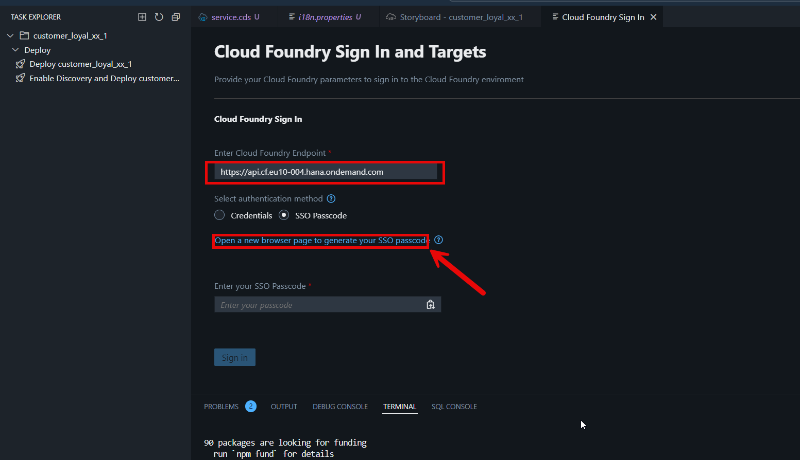

# Prepare & Deploy CAP app  

The last step in **SAP Build Code** is to deploy the application to Cloud Foundry environment on SAP Business Technology Platform. This process also involves the automatic creation of destinations, enabling OData services to be utilized by other tools such as **SAP Build Apps**.

## Preparation

As we want to create a customized UI with SAP Build Apps on top of the deployed OData services, we need to create a new service with plain entities (non-draft projections) to support the CRUD (Create, Read, Update, Delete) operations without the extra draft management layer.

1. Navigate to **Joule** and click on **Reset Conversation**.
    
    

2. Go to your **Storyboard** and click on the Joule icon beside **Services**.

    Type in the following prompt:
    
    ``` code
    Keep existing service in place. Add an additional service 'customer_loyal_XX_crudSrv' with the same entities as in the original service but make them plain (not draft enabled). 
    ```
    
    Click on **Generate**.

    

3. Make sure Joule adds a new service `customer_loyal_XX_crudSrv` while keeping the existing service `customer_loyal_XXSrv` in place.

    
    

    Press **Accept** to accept the changes.

    > [!TIP] In case Joule doesn't give the expected output, try regenerating the code. 
    >
    > Alternatively, open `service.cds` and replace the code in it with the one from below:
    > ```code
    >    using { ZAPI_PRODUCT_SRV } from './external/ZAPI_PRODUCT_SRV.cds';
    >
    >    using { customer_loyal_XX as my } from '../db/schema.cds';
    >
    >    @path : '/service/customer_loyal_XX'
    >    service customer_loyal_XXSrv
    >    {
    >        @odata.draft.enabled
    >        entity Customers as
    >            projection on my.Customers;
    >
    >        @odata.draft.enabled
    >        entity Purchases as
    >            projection on my.Purchases;
    >
    >        @odata.draft.enabled
    >        entity Redemptions as
    >            projection on my.Redemptions;
    >
    >        entity A_ProductBasicText as
    >            projection on ZAPI_PRODUCT_SRV.A_ProductBasicText;
    >    }
    >
    >    annotate customer_loyal_XXSrv with @requires :
    >    [
    >        'authenticated-user'
    >    ];
    >
    >    @path : '/service/customer_loyal_XX_crud'
    >    service customer_loyal_XX_crudSrv
    >    {
    >        entity Customers as
    >            projection on my.Customers;
    >
    >        entity Purchases as
    >            projection on my.Purchases;
    >
    >        entity Redemptions as
    >            projection on my.Redemptions;
    >
    >        entity A_ProductBasicText as
    >            projection on ZAPI_PRODUCT_SRV.A_ProductBasicText;
    >    }
    > ```

4. You should see that the new service has been added to the **Storyboard**.

    

5. We also need to implement the same logic for the new service `customer_loyal_XX_crudSrv` as we have for `customer_loyal_XXSrv`.

    Select the **Explorer** icon and open file **srv** -> **service.js**.

    Clone class extension **customer_loyal_XXSrv** by copy-pasting it just below the original class extension.

    For the just pasted class extension, change the reference from **customer_loyal_XXSrv** to **`customer_loyal_XX_crudSrv`**

    Add **`customer_loyal_XX_crudSrv`** to **module.exports**, so that it looks like

    ``` code
    module.exports = {
        customer_loyal_XXSrv,
        customer_loyal_XX_crudSrv
    };
    ```

    
    

## Deployment
The final step in SAP Build Code for us is to deploy the application to Cloud Foundry. This process also involves the automatic creation of destinations, enabling ODATA services to be utilized by other tools such as SAP Build Apps.

1. For the deployment go to **Task Explorer** and select the Play icon (**Run**) next to **Enable Discovery and Deploy** option.

    >[!NOTE] Please be patient as this may take a few minutes.

    

2. Check if the task has launched in the terminal

    

3. During the deployment a new page will be opened to to sign into Cloud Foundry.

    

<!-- 4. Please note that this is a shared landscape so we need to minimize the size of your application. Before deploying the application to Cloud Foundry, we need to set the memory footprint of the application.

1. Select the **Explorer** icon and open the **mta.yaml** file.

    

2. Search the **memory** parameter of your application and change the value to **64MB**.

    

3. Right select the **mta.yaml file** and select **Build MTA Project**

    

4. When the job is complete, the following message is printed to the **Terminal**.

     -->

5. Make sure that Cloud Foundry Endpoint is set as `https://api.cf.eu10-004.hana.ondemand.com`.
    
    Select **Open a new browser page to generate your SSO passcode**

    

6.  Enter **`iac-platform`** and select **Sign in with alternative identity provider**.

    

7.  Make sure you are signed in as a ricky.miller user and copy the **Temporary Authentication Code**.

    

8.  Paste the **Code** and **Sign In**.

    

9.  Select the Organization and Space as specified here:

    <!-- > [!NOTE] Normally Organization and Space should be auto populated -->

    - Organization: **`iac-sap-build-code-cf-org`**
    - Space: **`dev`**
  
    Select **Apply**

    

10. Note that the deployment of the application should proceed further.
    
    After the successful deployment (May take several minutes) you will find the link of the deployed application in the terminal.

    - Use **Ctrl+click** on Windowns or **CMD+click** on Mac try it out!

    

11. You should see 3 Web Applications and 2 Services, as per our configurations.

    Click on **Customers** tile.

    

12. At the moment, there is no data.

    Create a Customer entity by pressing **Create**.

    

13. Provide details as follows:

    - Name: `Alice Johnson`
    - Email: `alice.johnson@example.com`
    - Customer Number: `1200547`

    Leave other fields blank.

    Press **Create**.

    

> [!TIP|icon:fa-solid fa-check|label:Congratulations]
You have used the **generative AI capabilities** of **Joule in SAP Build Code**, to create a **CAP** service for a **customer loyalty program application**.
<!-- In order to receive the digital badge, please submit a screenshot of deployed app on BTP showing the URL of the application as well. -->
 
> [!TIP]
> Furthermore, you can validate the code/app by performing following steps:
> - Open the Purchases app
> - Now we will simulate making a purchase using the Built-in SAP Fiori Elements app
> - Click Create
> - Enter 1000 for the Purchase Value and choose your customer and product. Create the Purchase.
> - Verify that the Reward Points were properly calculated
> - Switch back to the Customers app where you see the details for your customer
> - Note the values here. They are not updated until we refresh, so note the total values before refreshing and see if they are both updated as expected. Just use the browser refresh to update the details.
> - Did the logic work?
> - Now let’s redeem all the customer’s reward points. Copy that value.
> - Go back to the Overview page, and open the built in app for Redemptions
> - Create a Redemption for your customer and the total reward points for that customer (You might try to redeem more points first – if our logic is working, it should not allow this!)
> - Go back to thew Customer’s details and note the total amount and predict what he new amounts should be after the redemption.
> - Refresh the tab and see if your prediction matches the result!
