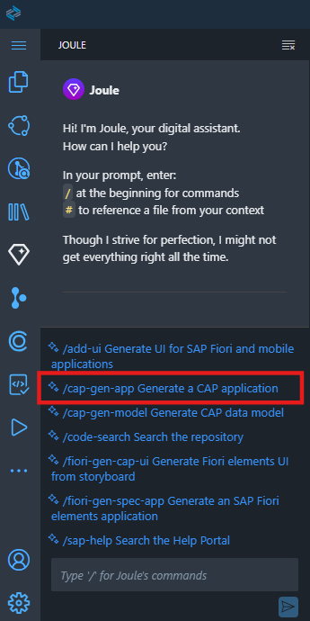
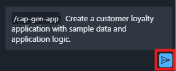
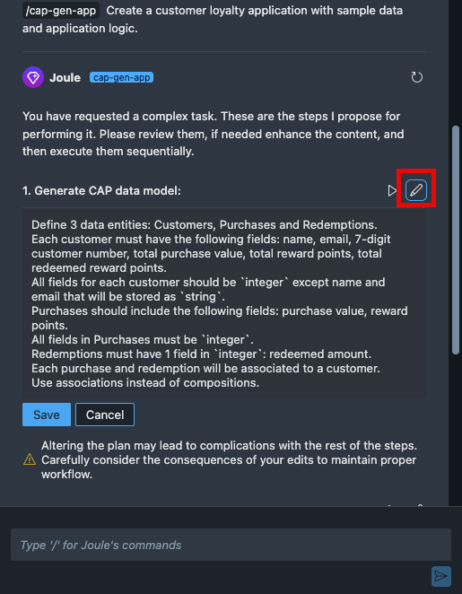
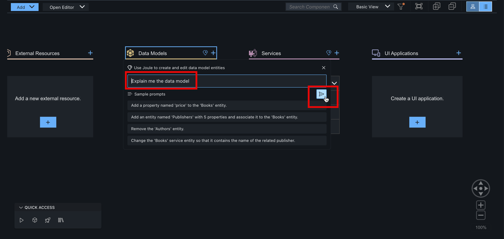
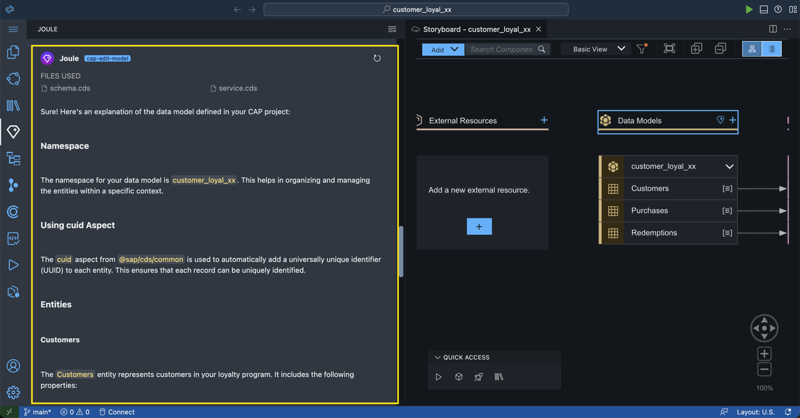

# Create CAP Application with Joule

In this lesson, you will use the Generative AI capabilities of Joule to create a customer loyalty program application (CAP service) in SAP Build Code in a multi-agent approach that streamlines the development process: 

- generating a **data model**;
- generating a **sample data**;
- generating an **application logic**.

> [!NOTE] We could also create all of this by writing the code manually. However, we are going to use the **Generative AI** capabilities of **Joule and SAP Build Code** to generate the code. Thus, significantly **reducing the time and effort** required to develop the customer loyalty program application.

> [!WARNING] Joule is a Generative AI assistant that will create code for you. The code might be different every time you trigger the prompt, so the examples shown in the tutorial might not be exactly the same as what you see in your system.

1. Launch the Joule digital assistant by navigating to **Joule** tab via the sidebar menu on the left. 

   > [!TIP]
   Please wait for the digital assistant to open. If it fails to open then please refresh your browser.

    

    > [!TIP] If you do not see the icon, click Additional Views and select **Joule** from the list.
    >
    >

2. At the bottom of the Joule view, select the '/cap-gen-app` slash command.

     

3. Copy the prompt below.

    ```code
    Create a customer loyalty application with sample data and application logic and then paste the code below in the text field.
    ```

4. Click the arrow  to send the prompt to Joule.

     

    Since this is a complex task, Joule divides it into different steps and provides suggestions for the prompts for each step. You can edit these prompts before triggering the generation. 

     

    While Joule suggests certain properties for the entities, let's edit the prompt to offer a clearer description that aligns better with the data model's requirements. 

5.  Copy the prompt below.

    ```code
    Define 3 data entities: Customers, Purchases and Redemptions. 
    Each customer must have the following fields: name, email, 7-digit customer number, total purchase value, total reward points, total redeemed reward points. 
    All fields for each customer should be `integer` except name and email that will be stored as `string`.
    Purchases should include the following fields: purchase value, reward points and selected product. 
    All fields in Purchases must be `integer` except selected product. 
    Redemptions must have 1 field in `integer`: redeemed amount. 
    Each purchase and redemption will be associated to a customer.
    Use associations instead of compositions.
    Use namespace 'customer_loyal_${number}'.
    ```
    
6. Click  to edit step 1 and replace the prompt with the one you just copied. 

     

7. Click **Save**.

8. Click  to run the step and **generate the CAP data model**.

      

    The staging files are generated and are displayed below your prompt. You can view or edit them by clicking on the file name. 

     

    > [!NOTE] If you only want to create a data model and service, you can use the `/cap-gen-model` slash command. 

    Let’s edit the sample data to match requirements. 

9.  Copy the prompt below.

    ```code
    Create sample data with meaningful information. 
    All customer numbers must be 7 digits long and one customer must use the customer number 1200547. 
    No fields may be empty. 
    Total purchase value must be smaller than 10000 not rounded. 
    Both total reward points and total redeemed reward points must not be rounded, must not be identical. and must always sum to one-tenth of the total purchase value for each customer
    ```
    
10. Click  to edit step 2 and replace the prompt with the one you just copied.
    
     

11. Click **Save**.

12. Click  to run the step and **generate the CAP sample data**.
    
    The CSV files are created and can be opened for review from the Staging Files list.

     

    > [!NOTE] You can also trigger the sample data generation separately using the `/cap-gen-data` slash command or edit the existing data using the `/cap-edit-data` slash command.

    Now we will add application logic so that for each purchase, customers receive reward points equal to one-tenth of the purchase price. The purchase value will be added to the customer's account. 
    Additionally, when customers use reward points, the points should be deducted from their total reward points and added to their total redeemed points.

13. Copy the prompt below.

    <!-- ```code
    Implement application logic so that reward points of each purchase will be one tenth of the purchase value. 
    Each purchase value will be added to the total purchase value of the related customer. 
    Each reward point will be added to the total reward points of the related customer. 
    Furthermore, deduct the redemption amount from the customer's total reward points and add that to their total redeemed points.
    ``` -->

    ``` code
    Implement application logic to calculate the reward points for each purchase. It will be one tenth of the purchase value.
    When Customer makes a purchase do the following:
    Calculate reward points of the purchase and assign its value to Purchase entity.
    Add purchase value to the total purchase value of the related customer. 
    Add reward points to the total reward points of the related customer. 
    Furthermore, when Customer redeems points, deduct the redemption amount from the customer's total reward points and add that to their total redeemed points.
    Use before CREATE handler.
    ```
    
14. Click  to edit step 3 and replace the prompt with the one you just copied. 

     

15. Click **Save**.

16. Click  to run the step and **generate the CAP application logic**.

      

    The relevant files are created with the required code. 

    > [!NOTE] In an existing project with application logic available, you can use the `/cap-app-logic` slash command to enhance or modify the logic.

17. **Accept** the code.

     

18. You should see the details updated in your storyboard.

     

19. Notice that you can also engage with Joule directly from your **Storyboard** by clicking on the Joule icon beside **Data Models** and **Services**.

    

20. Click on Joule icon beside **Data Models**.

    Click on **Sample prompts** to understand what type of prompts can be specified.

    

21. For example, let's use Joule to explain to us once again the data model in our project.

    Copy and paste the prompt from below to the input box.
    
    > [!Note]
    >Joule's response may vary each time. This is just an example. 

    ```code
    Explain me the data model
    ```

22. Click on the arrow  to send the prompt to Joule.

    
    
    > [!TIP]
    > If you see an error, please refresh the browser and retry.

22. Review the output of the Joule with an explanation of the data model.

    

    > [!TIP]
    >Joule helps with understanding the existing CAP project (maybe the one that was created by someone else). 
    >Moreover, the output can also be used as design documentation of data model for future reference.
    >
    >Refer to the blog post <a href="https://community.sap.com/t5/technology-blogs-by-sap/enhance-your-existing-cap-projects-with-joule-in-sap-build-code/ba-p/13777244" target="_blank">Enhance your existing CAP projects with Joule in SAP Build Code</a> to understand more on how you can enhance your existing CAP projects with Joule in SAP Build Code and see the examples of the other prompts you could write to Joule.

<!-- 23. By default Joule generates the project under namespace *'myNamespace'* (or something similar). We want something more specific, so let's ask Joule to rename it.

    Engage Joule by clicking on a Joule icon beside **Data Models**.

    Provide the prompt: 

    ```code
    rename 'myNameSpace' to 'customer_loyal_${number}'
    ```
    

24. Review and **Accept** the changes.

    
     -->

*Optionally* you might play around with some further prompts, like 

<!-- - **`Explain me the data model`** - 
    Joule helps with understanding the solution, moreover, the output can also be used as design documentation of data model for future reference. -->
- **`Add comments to the data model`** - Joule helps to improve the interpret-ability and maintenance. This is a bit tricky as Joule may refuse it, but try to convince it with "yes, you are allowed to do it"
- **`Review and criticize the code`** - Joule acts as a peer developer for code review
- **`Implement the suggestions`** - Joule help to implement the suggestions from last code review
- **`Apply best practices of CDS data modeling`** - Or simply ask Joule to apply the general best practices of CDS data modeling without explicit code review
- **`Make it production ready`** - Joule help with final check on the data model before production.
     