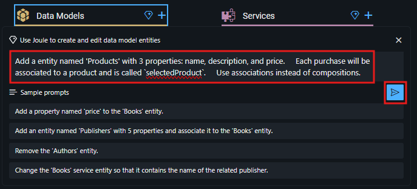
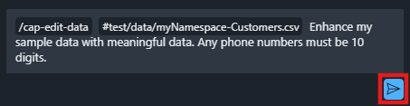

# Enhance CAP Application with Joule

In this lesson, you will use the Generative AI capabilities of Joule to enhance the generated code that includes: 

<!--- adding a new entity **Products**; -->
- adding a new property **phoneNo** to `Customers` entity;
- generating sample data;
- comment the code in line. 

<!-- 1. Click on Joule icon beside **Data Models**.

     

2. Copy and paste the prompt from below to the input box.
    
    > [!Note]
    >Joule's response may vary each time. This is just an example. 

    ```code
    Add a entity named 'Products' with 3 properties: name, description, and price. 
    Each purchase will be associated to a product and is called `selectedProduct`. 
    Use associations instead of compositions.
    ```

3. Click on the arrow  to send the prompt to Joule.

    

4. Review the generated data model and accept it by clicking the **Accept** button.

    <!-- Depending on the server, it can take up to 2 minutes for Joule to create the data models and services for you.<br>
    Once you accept the code, you will see the update on the right side under Storyboard tab<br> 

     -->

1. Click on Joule icon beside **Data Models**.

     

2. Copy and paste the prompt from below to the input box.

    ```code
    Add a property named 'phoneNo' to 'Customers' entity
    ```

3. Click on the arrow  to send the prompt to Joule.

    

4. Review the generated data model and accept it by clicking the **Accept** button.

    

5. Navigate to **Open Editor**, then select **Sample Data**.

    

6. Select the **Customers** data entity and select **Enhance**. This will open again Joule to modify the sample data. 

    

7. Copy and paste the prompt from below to the input box.

    ```code
    Enhance my sample data with meaningful data. Any phone numbers must be 10 digits.
    ```

8. Click on the arrow  to send the prompt to Joule.

    

9. Review the generated data and accept it by clicking the **Accept** button.

    

So far, we have edited the existing data model and the created sample data using Joule. To ensure the generated data meets expectations, it is crucial to use clear and precise prompts. For instance, indicating specific ranges, formats, or patterns can help tailor the output to match the desired criteria. Do not include any detail about the application logic in the data model as it will be ignored by Joule. 

Joule has another capability called inline code-completion that provides code snippet suggestions directly in the editor itself (e.g. for JavaScript) based on your typing input the the context. It will be enabled by default. With the Joule Code Assistant it is  possible to create explanatory comments in code files such as JavaScript. 

10. Navigate to **Explorer**, open CDS file **schema.cds** and select the **Purchases** entity. 

    

11. Choose **Add Comments**.

    

12. Review the generated comment and accept it. 

    

You can also play around with Code Refractor. With SAP Build Code you can refactor existing code out of the editor itself without needing to write a prompt for this. Once the refactor capability has been selected, Joule will take a moment to provide a suggestion for an improved code. The suggestions can be for a code block or for multiple seperate lines of code, each requiring the user to check and accept or deny the suggestions. 