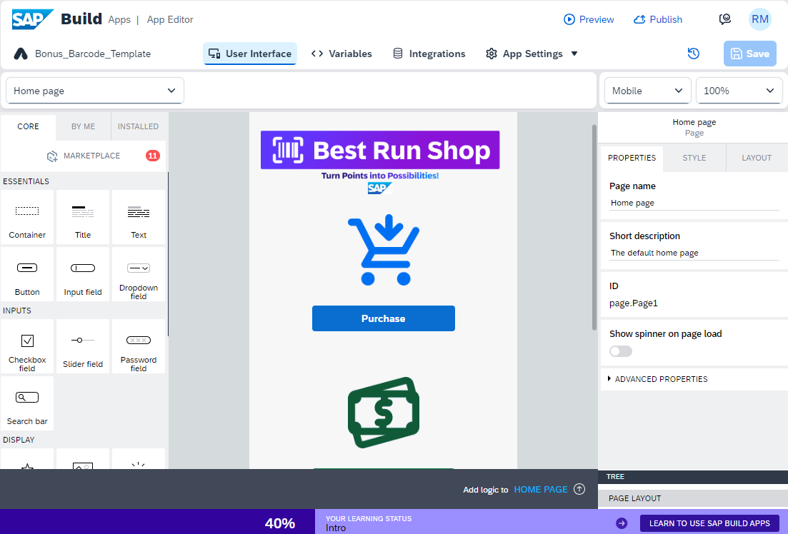

# Create Project from Template 

## Access Lobby

The starting point for this tutorial is the Lobby of SAP Build, the central entry point for all SAP Build products.

Open the lobby: <a href="https://iac-sap-build-code.eu10.build.cloud.sap/lobby" target="_blank">SAP Build Code Lobby</a>

<!-- Use the provided user credentials to log on using **https://iac.accounts.ondemand.com/** as Identity Provider

- User Name: **rmiller${number}**
- Password: **Welcome1!**

 -->

## Create a new project

1. Search for **Bestrun_Shop_Template** from the list of projects.

    Click > on the right side and Select Versions. Then click the … (3 dots)

    Select **Save As New Project**.

    

2. Provide the following:

   - Name: `Bestrun_Shop_${number}`
   - Description: `SAP Build Apps UI for the customer loyalty program application`

   And finally select **Save as New**.

    

3. You have successfully created the UI project from the prepared template.

    
