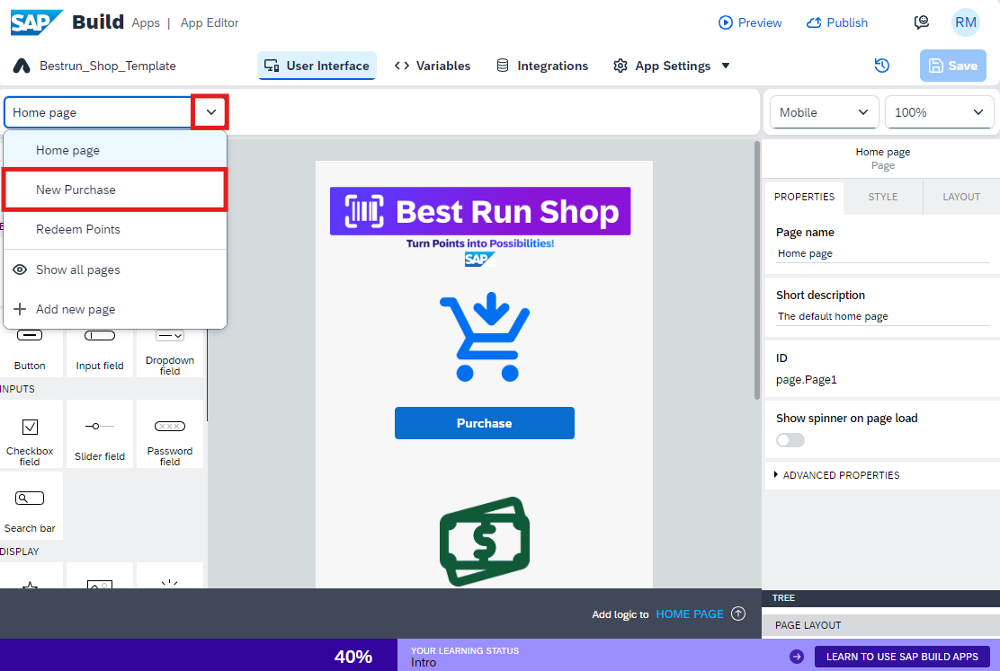
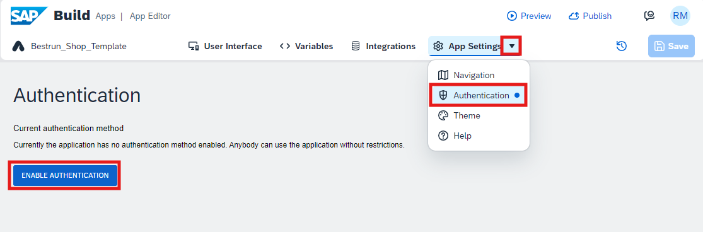
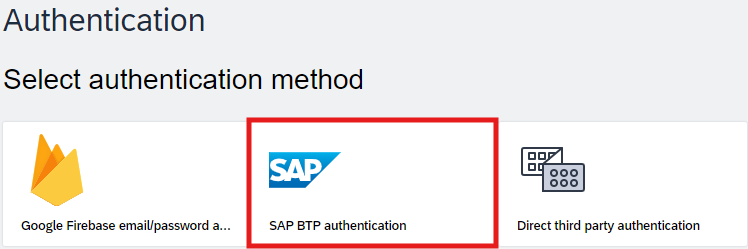
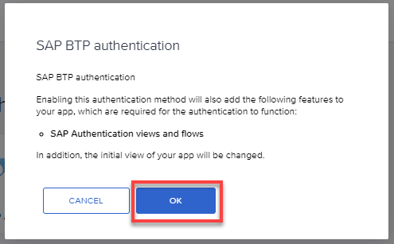
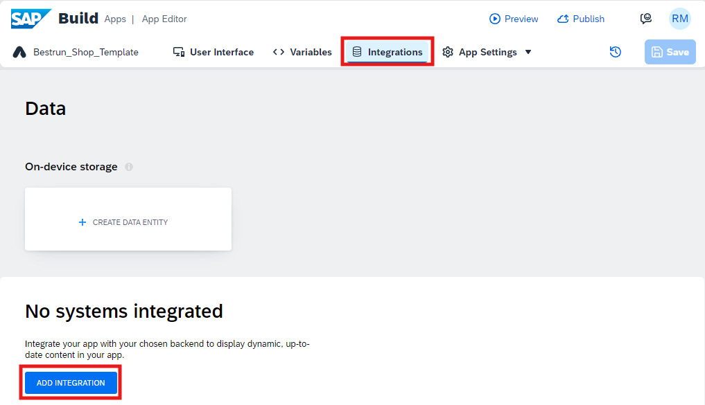
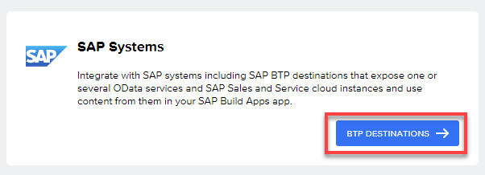
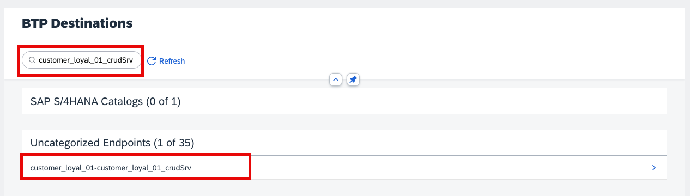
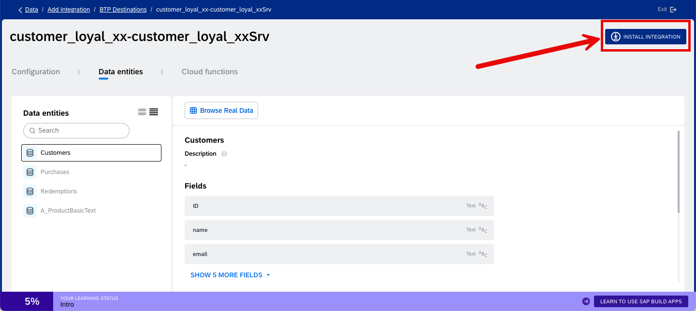
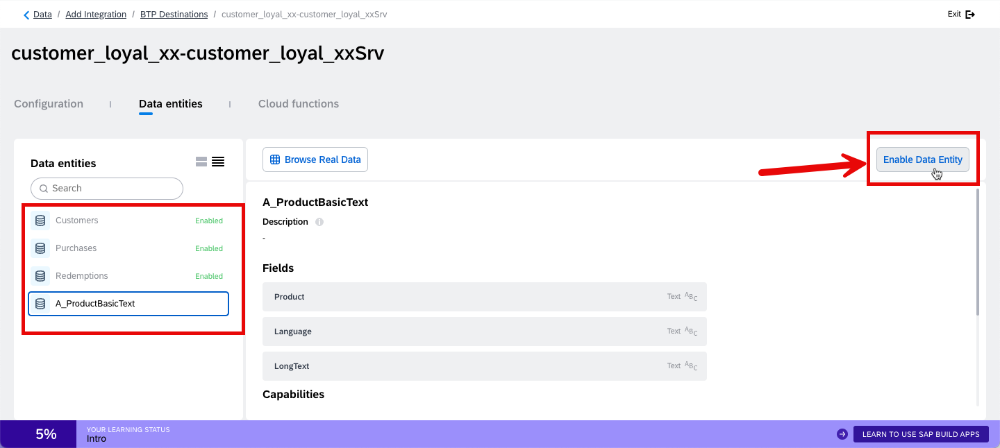

# Authentication and Data Integration  

1. Click on page dropdown list. 
   
   Go to the **New Purchase** page.

    

2. Go to **App Settings** > **Authentication** > **Enable Authentication**

    

3. Select **SAP BTP authentication** > **OK**.

    
    

4. Go to the **Integrations** > **Add Integration**.

    

5. Select **BTP Destinations**

    

6. Search for your SAP Build Code project name: **`customer_loyal_${number}_crudSrv`** and select it.

    

7. Select **Install Integration**

    

8.  Select **Enable Data Entity** for all four (4) Data entities listed on the left:

    - Customers
    - Purchases
    - Redemptions
    - A_ProductBasicText
   
    Select **Save**.

    