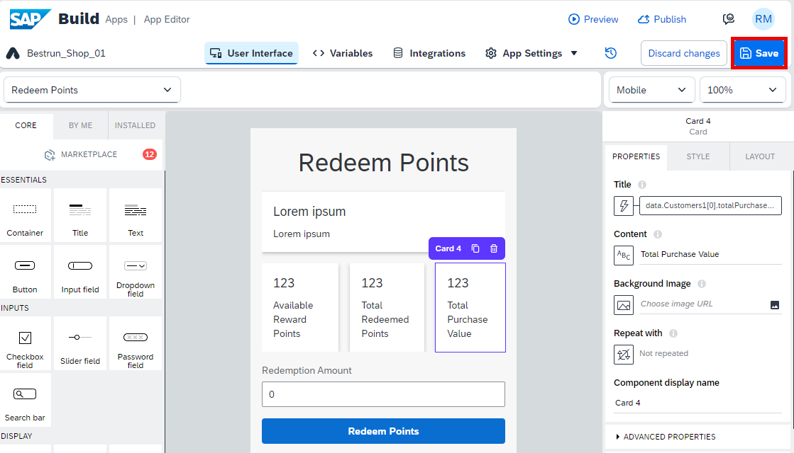
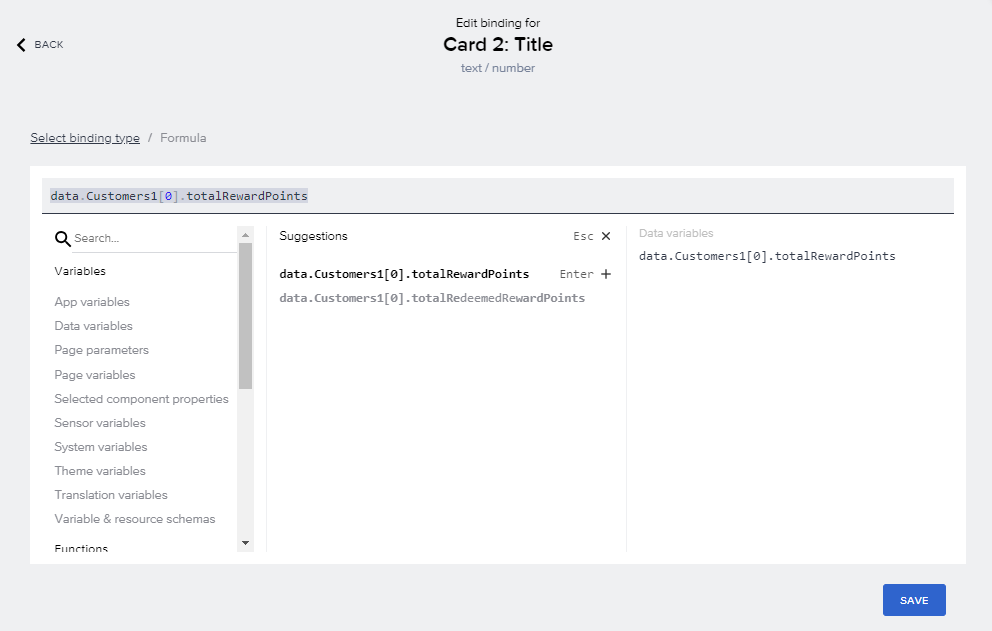
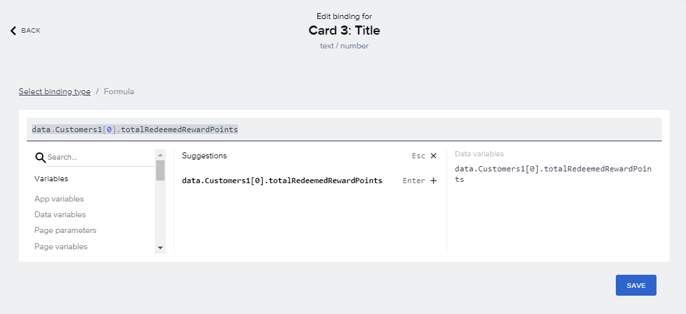

# Logic for UI Components  

## Configure Redeem Points Page

1. Select **Card 1** > Click to **ABC icon** under Title

    

2. Select **Formula** > Select **Formula Bar**

    

3. Paste the formula below > Select Save and Save again.

    ```
    "Customer Number: " + data.Customers1[0].customerNumber
    ```

    

4. Select **Card 1** > Click on **ABC icon** under Content

    

5. Select **Formula** > Select **Formula Bar**

    Paste the formula from below and select **Save**

    ```
    "Customer Name: " + data.Customers1[0].name
    ```

    

6.  Select **Card 2** > Click on **ABC icon** under Title

    

7. Select **Formula** > Select **Formula Bar**

    Paste the formula from below and select **Save**

    ```
    data.Customers1[0].totalRewardPoints
    ```

    

8. Select Card 3 > Click on **ABC icon** under Title.

    

9. Select **Formula** > Select **Formula Bar**
    
    Paste the formula from below and select **Save**

    ```
    data.Customers1[0].totalRedeemedRewardPoints
    ```

    


9. Select Card 4 > Click on **ABC icon** under Title.

    

10. Select **Formula** > Select **Formula Bar**
    
    Paste the formula from below and select **Save**

    ```
    data.Customers1[0].totalPurchaseValue
    ```

    

11. **Save** your App 

    

## Configure Purchase Page

1. Go to the Page: **New Purchase**

    

2. Select **Card 1** > Click on **ABC icon** under Title

    

3. Select **Formula** > Select **Formula Bar**

    Paste the formula from below and select **Save**

    ```
    "Customer Number: " + data.Customers1[0].customerNumber
    ```

    

4. Select **Card 1** > Click on **ABC icon** under Content

    

5.  Select **Formula** > Select **Formula Bar**
    
    Paste the formula from below and select **Save**

    ```
    "Customer Name: " + data.Customers1[0].name
    ```

    

6.  Select **Card 2** > Click on **ABC icon** under Title

    

7.  Select **Formula** > Select **Formula Bar**

    Paste the formula from below and select **Save**

    ```
    data.Customers1[0].totalRewardPoints
    ```

    

8.  Select Card 3 > Click on **ABC icon** under Title

    

9.  Select **Formula** > Select **Formula Bar**

    Paste the formula from below and select **Save**

    ```
    data.Customers1[0].totalRedeemedRewardPoints
    ```

    


10. Select Card 4 > Click on **ABC icon** under Title

    

11. Select **Formula** > Select **Formula Bar**

    Paste the formula from below and select **Save**

    ```
    data.Customers1[0].totalPurchaseValue
    ```

    

12. **Save** your App 

    