# Preview and Test  

1. Go to **Preview**

    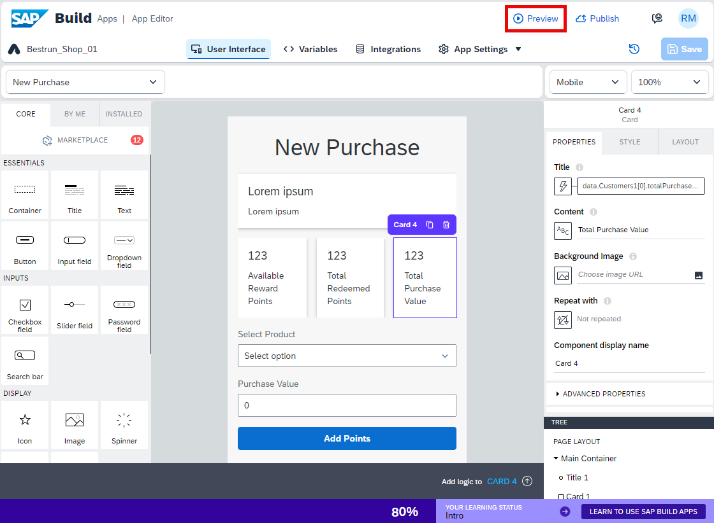

2. Download **SAP Build Apps Preview** from your mobile store

    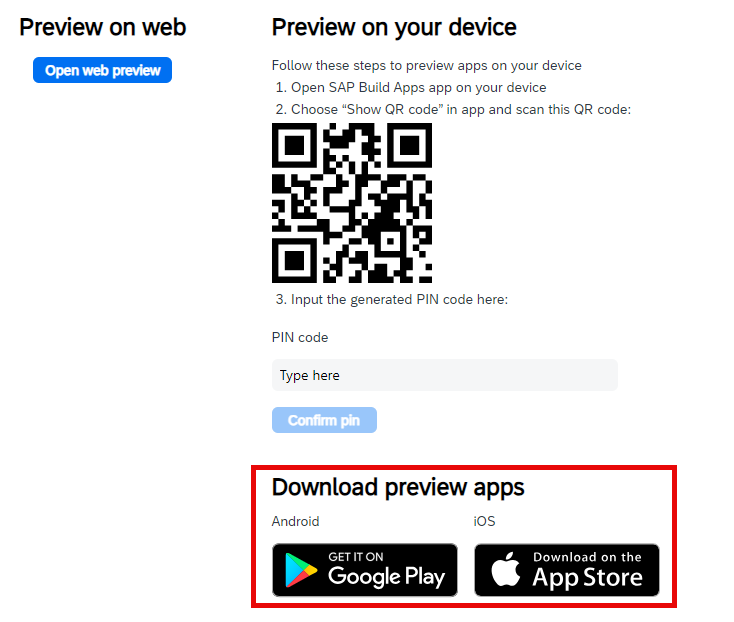

3. Install the **SAP Build Apps Preview** application on your mobile device.

    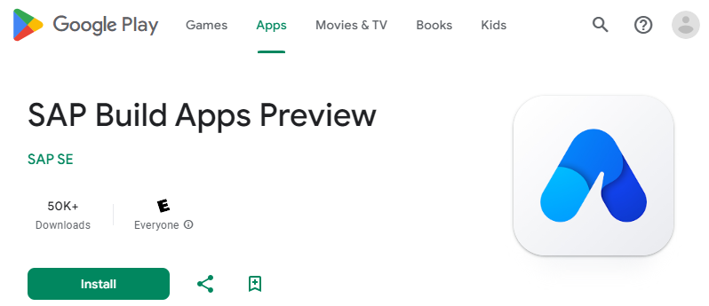
    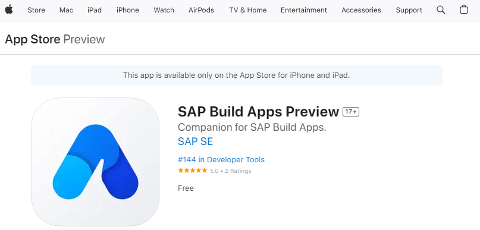

3. Launch **SAP Build Apps Preview** in your mobile device then select **Other login options**.

    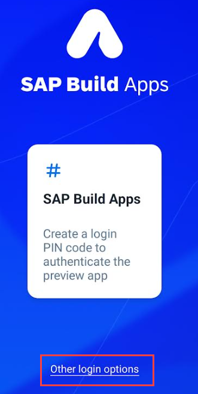

4. Select the edition **SAP Build Apps EU10** and select **Generate code**.

    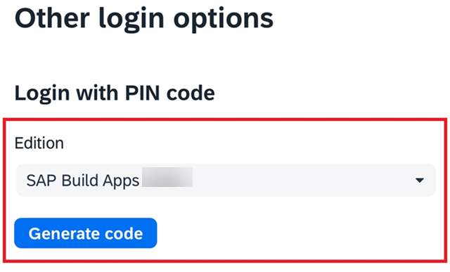

5. Note down the **PIN Code**.

    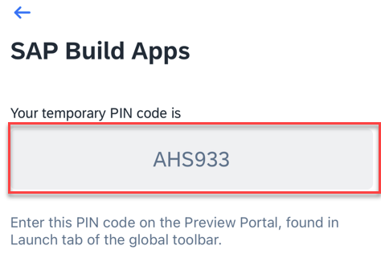

6. Type in the **PIN Code** on your web browser page and press **Confirm pin**.

    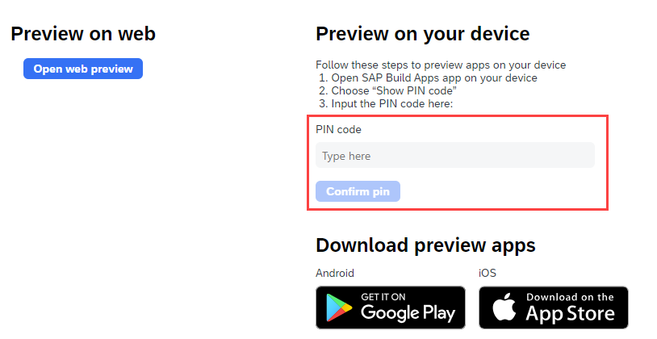

7. Mobile Previewer will show you the list of projects in your lobby.
   
   Launch the **Bonus_Barcode_${number}** app > Click on **New Purchase**

    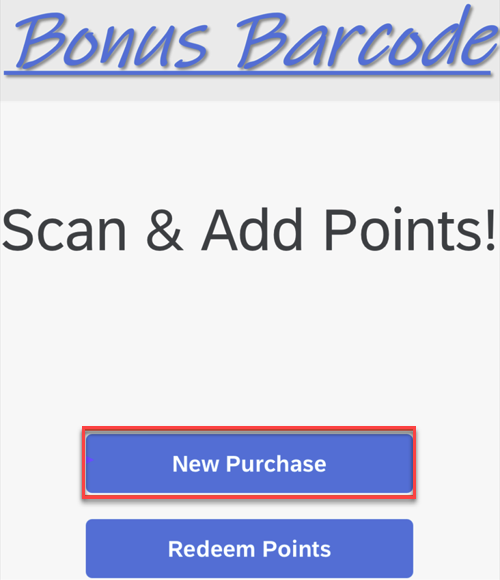

8.  Scan the **Customer Loyalty Card** here using Barcode Scanner

    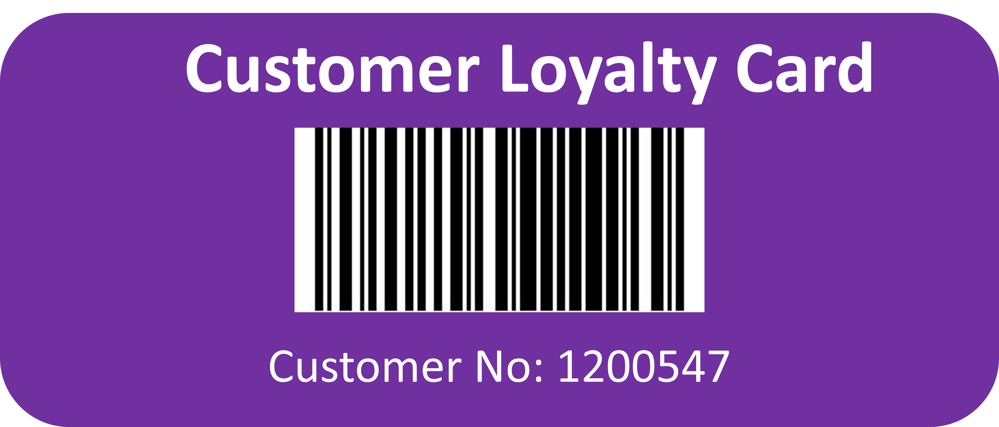

   > [!TIP]
   >If you are using an Android device then you may need to update the App permissions
   >
   >**SAP Build Apps - Permissions - Camera - Photos and Videos permission - Allow**
   >
   > 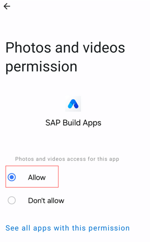
   >
   > Alternatively, enter the customer number (1200547) manually!

9.  Select a Product from dropdown list

    Add some value for the Purchase Value
    
    Click on **Add Points!**

    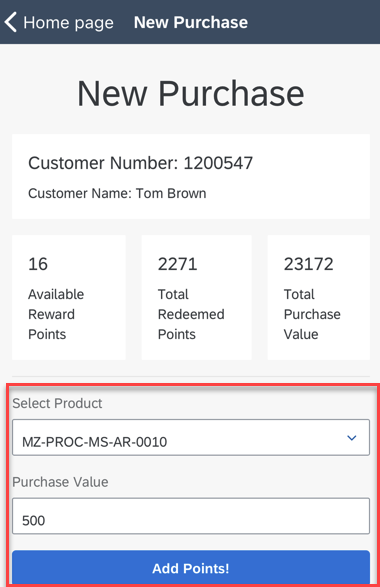

10. See the Response from the backend service

    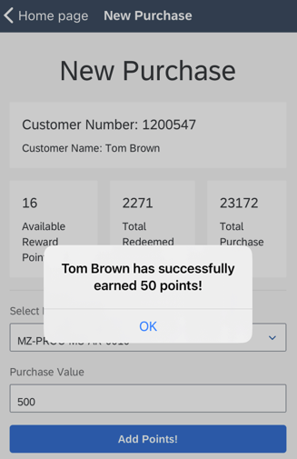

11. Go to Redeem Points

    Redeem some points from the same customer and experience the flow

    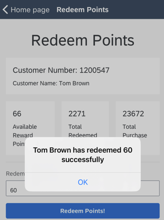

    [!NOTE|icon:fa-solid fa-camera|label:Screenshot]> Take a screenshot of the redeem points screen. Click <a href="mailto:sap_btp_adoption_workshop@sap.com?subject=BTP_AI_ADOPTION_RMILLER${number}_CODE01&body=Please make sure the subject looks ok, and attach the screenshot before sending.">here</a> to create a new email. Send the screenshot to `sap_btp_adoption_workshop@sap.com`, including `BTP_AI_ADOPTION_RMILLER${number}_CODE01` as the subject.

12. Go to **SAP Build Apps Design Time** > Select **Integrations** tab > **Customers** entity

    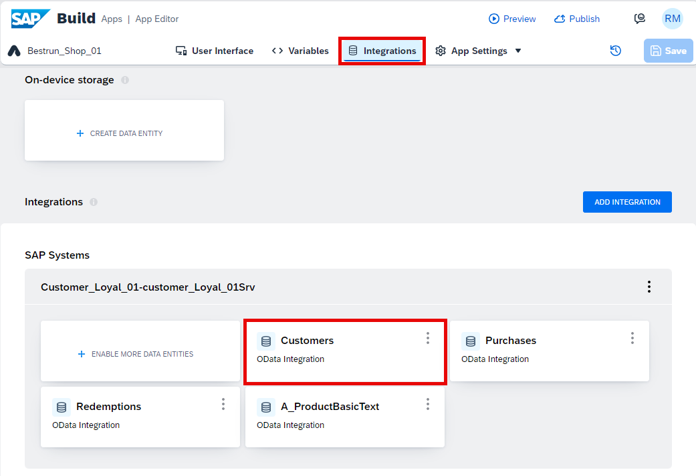

13. Click om **Browse Real Data**

    See your updates for the Customers data entity.

    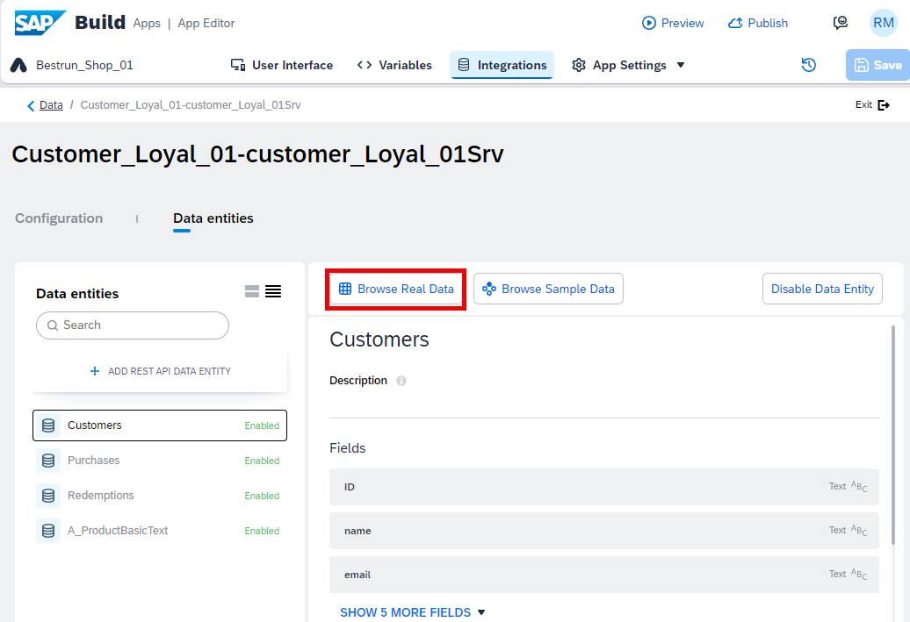

> [!TIP|icon:fa-solid fa-check|label:Congratulations]
You have successfully built and previewed a **SAP Build Apps** application.