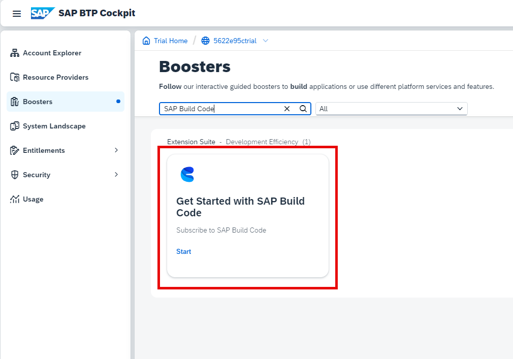
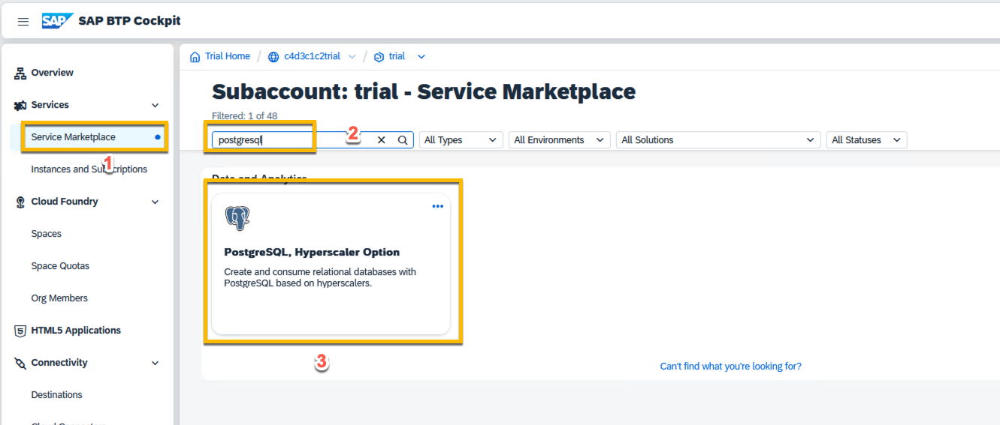

#  BTP Tenant Setup  

###### *SAP BTP Adoption Lab BYOT - Speed Up Clean Core Extension with BTP CAP AI based Agile Development*

---

# Setup SAP Build Code in SAP BTP
<!-- description --> SAP Build Code provides generative AI-based code development with Joule copilot, optimized for Java and JavaScript application development. It offers a turn-key environment for coding, testing, integrations, and application lifecycle management.

Perform these preparatory steps to set up your system for creating your business applications in SAP Build Code.

### Run the SAP Build Code Booster

>**Note** This tutorial assumes that you are using an SAP BTP Trial account. If you are using a different account, some steps might be different.

1. Access your **BTP global account**.

2. In the navigation pane, click **Boosters**. 

    
3. Search for **SAP Build Code**.
   

    >There is a booster for each of the SAP Build Code service plans. Make sure to select the one relevant to the plan you want to work in.
    
4. Open the booster to see the overview, components, and additional resources, and click **Start**.

   

    The booster checks for required authorizations, compatible providers, and regions, as prerequisites for successful execution.

5. After running the booster, in the popup window, click **Navigate to Subaccount**.
    

### Verify Subscription
1. From the navigation pane, select **Services** > **Instances and Subscriptions**.
   

2. Make sure you are subscribed to SAP Business Application Studio and to SAP Build Code. 

3. Click **SAP Build Code**.

    The SAP Build lobby opens.

---

# Set Up SAP Build Work Zone, standard edition

## Subscribe to the services

Before you can access and use the SAP Build Work Zone, standard edition services, you first need to subscribe to them.

1. Click **Services** in the left navigation panel and choose **Instances and Subscriptions**.

Here we can see all of the service instances and subscriptions that have been created for the subaccount. Currently there are none. 
Let's change that. 

2. Click on the **Create** button on the top right hand side of the UI. 

   
    
3. In the popover that appears use the dropdown available for the "Service" field and choose **SAP Build Work Zone, standard edition** (1). In the plan field select **standard** (2). This allows us to create and configure sites for centralised access to our applications. 
Hit the create button (3). 

   

> ℹ️ Note: The instance type for plan **standard** will be required if you wish to use APIs to integrate with other services such as Cloud Transport Management Service for example, but don't worry about this for now.

Once the creation process has finished successfully, you will see the new subscription in the cockpit. 

You will see button in the top right hand corner **Go to Application**. 

All SAP BTP services come with role collections, including administrative permissions which must be assigned to our users. In the case of SAP Build Work Zone we will need to assigned to the `Launchpad_Admin` role. In this step, you'll assign yourself to this role so that you can access the service and carry out administrative tasks.

4. Select **Security > Role Collections** from the side menu.

    
Here we can either use the search field and start typing Launchpad to find the `Launchpad_Admin` role collection or we can simply select it from the list. 
    

    
 Click on the line item (or the arrow at the end of the line item) to expand the role collection details pane.

 

Here we see more detail about the role collection: the roles that the collection includes, the users who have been assigned to the role collection and any user groups and attribute mappings that have been created foe this role collection.
Click the **Edit** button at the top of the panel (see image above). 

5. Here you are playing the role of the subaccount administrator. Under the **Users** tab, enter your email in both the **ID** and the **E-Mail** fields. In the **Identity Provider** dropdown choose the IAS tenant where trust has been established for the subaccount. In our case it is **Custom IAS tenant**. Then click the **Save** button at the top of the screen.

 We have now assigned the `Launchpad_Admin` role collection to our workshop user and you can access SAP Build Work Zone, standard edition and carry out all your admin tasks.
 Let's access the application.

6. From the side panel, click Services and then **Instances and Subscriptions**.
Under the **Subscriptions** tab we can see the subscription to SAP Build Work Zone standard edition that we created earlier. We can now either click the available link **SAP Build Work Zone, standard edition** or if we enter the details view, we can also click **Go to Application** button on the right.

7. The service opens with the Site Directory in focus. This is where you'll create and manage your sites.

> ℹ️ Note: It may take a few minutes for the admin role assignment to take effect.  If you get an **Access Denied** error, please try to access the admin environment in an anonymous window or logout and login again.

🎉 **Congrats** - you have finished this exercise! You have now created a subscription to SAP Build Work Zone, standard edition, assigned yourself the administrator role and are now ready to create your first site. 

---

# Set Up PostgreSQL on SAP BTP, Hyperscaler Option

To use the postgresql service in your global account, you need to first assign the service and the relevant plans to your global account and then manage the required entitlements.

### Prerequisites
* You must be a global account administrator to configure subaccount entitlements.
* You’re aware of the available service plans [Service Plans and Entitlements](https://help.sap.com/docs/postgresql-hyperscaler-option/postgresql-on-sap-btp-hyperscaler-option/service-plans-and-entitlements).

### Configuration in Cockpit

1. Navigate to your global account.
2. Choose Entitlements  Subaccount Assignments from the left hand-side navigation.
3. At the top of the page, select all the subaccounts for which you would like to configure or display entitlements.
4. Choose Go to apply the filter.

You can view a table for each of the subaccounts you selected, that displays the current entitlement and quota assignments.

5. If you cannot find PostgreSQL, hyperscaler option, please choose Configure Entitlements to start editing entitlements for a particular subaccount.
6. You can now edit the entitlements table:

7. Choose Save to save and exit edit mode.
For the development plan, you can assign a limit on number of instances created in a subaccount by specifying a limit. After the entitlements are made, the PostgreSQL, hyperscaler option service will be enabled in your cloud foundry Org.

---

